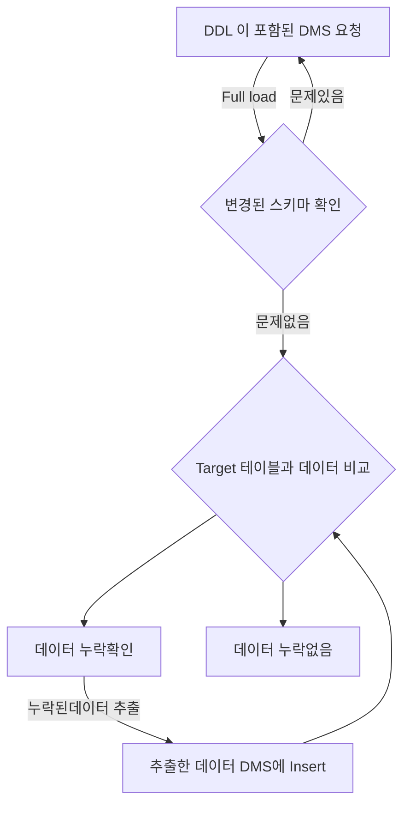

# career-architecture

> mermaid로 작성된 과제는 마크다운 파일(ARCHITECTURE.md)로 올려주시면 됩니다. (md 파일 내에 기존 구조를 넣어주세요) 
> 별도 아키택쳐나 모델링 도구를 사용한 경우에는 마크다운 파일(ARCHITECTURE.md)과 png, gif, jpg, pdf 파일 형식으로 architecture-{gitID}.png 파일명으로 upload 해주세요

# 요구사항

- [x] 담당 하는 업무에서 비효율적인 프로세스나 기술적 개선을 하고 싶은 부분의 현재 구조를 문서화 한다.
    - [x] 비효율적인 부분에 대한 분석내용을 정리한다.
    - [x] 비효율적인 부분에 대한 프로세스 또는 시스템 구조를 그려본다.

## 🚀미션

- 이름 : 유재영

### 개선포인트 분석

- 테이블에 컬럼 추가 이슈가 있을 때, 통계용 테이블들엔 Fast DDL 을 사용하지 못하여, DMS를 사용하고있다.
- DMS를 걸고 repl을 하다보면, 중간중간 데이터가 누락되는 경우가 있는데, 이런걸 확인 하기 위해, DMS와 원본DB 두개를 서로 비교하여, 누락된 데이터를 찾고있다.
- 데이터량이 많고, 여러명이 붙어서 확인할 수 없는 작업이라, 한 두명이서 하루치씩 모든 통계테이블을 확인하고 있는데, 해당 작업을 할때 마다 최소 5시간정도의 고정적인 비용이 발생하고있다.

### 프로세스

