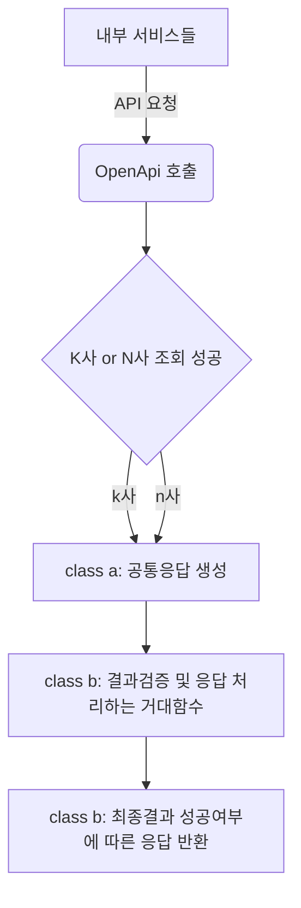

# career-architecture
> mermaid로 작성된 과제는 마크다운 파일(ARCHITECTURE.md)로 올려주시면 됩니다. (md 파일 내에 기존 구조를 넣어주세요) 
> 별도 아키택쳐나 모델링 도구를 사용한 경우에는 마크다운 파일(ARCHITECTURE.md)과 png, gif, jpg, pdf 파일 형식으로 architecture-{gitID}.png 파일명으로 upload 해주세요
# 요구사항
- [X] 담당 하는 업무에서 비효율적인 프로세스나 기술적 개선을 하고 싶은 부분의 현재 구조를 문서화 한다.
    - [X] 비효율적인 부분에 대한 분석내용을 정리한다.
    - [X] 비효율적인 부분에 대한 프로세스 또는 시스템 구조를 그려본다.

## 🚀미션
- 이름: 주명훈
### 개선포인트 분석
- 주소정보 API 이전 구현 
  - 내부적으로 주소정보를 구할 때 통신하는 (구)서버_API_를 (신)서버로 이전구현 하게 되었다.
  - 기존 로직은 가독성이 많이 떨어진다. 파편화 되어있다. 
  - 이전 구현하는 경우 클린코드를 지향하도록 한다.

### 기술적용 아키텍쳐
### 프로세스

