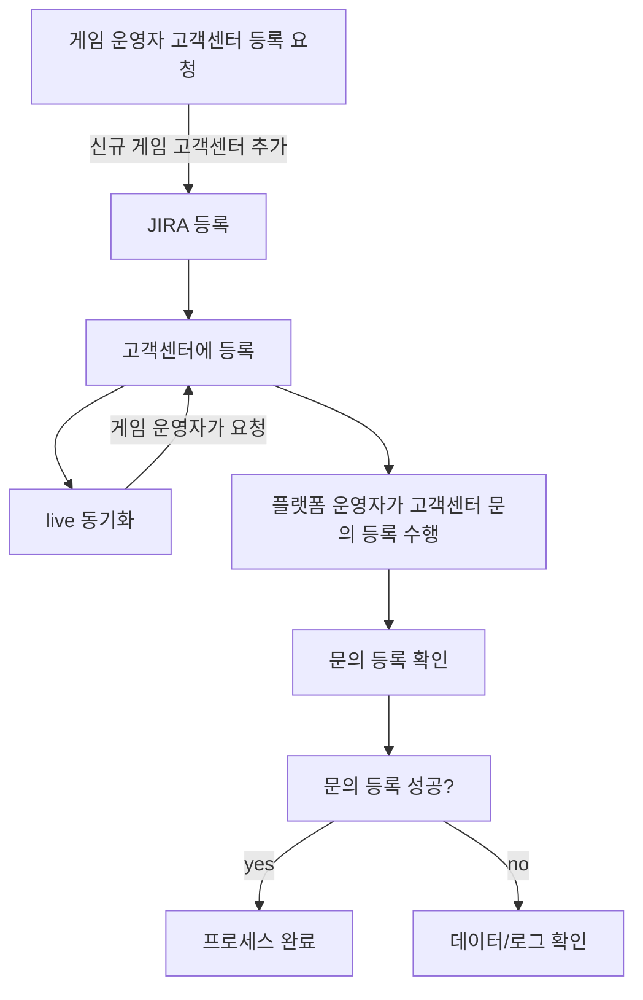

# career-architecture
> mermaid로 작성된 과제는 마크다운 파일(ARCHITECTURE.md)로 올려주시면 됩니다. (md 파일 내에 기존 구조를 넣어주세요) 
> 별도 아키택쳐나 모델링 도구를 사용한 경우에는 마크다운 파일(ARCHITECTURE.md)과 png, gif, jpg, pdf 파일 형식으로 architecture-{gitID}.png 파일명으로 upload 해주세요
# 요구사항
- [X] 담당 하는 업무에서 비효율적인 프로세스나 기술적 개선을 하고 싶은 부분의 현재 구조를 문서화 한다.
    - [X] 비효율적인 부분에 대한 분석내용을 정리한다.
    - [X] 비효율적인 부분에 대한 프로세스 또는 시스템 구조를 그려본다.

## 🚀미션
- 이름 : 최수정
### 개선포인트 분석
- 고객센터 생성 시 게임 플랫폼에 연동하기 위해 고객센터를 등록하는 jira 를 통해 반복적으로 등록하였다.
- 주기적으로 새로운 게임이 추가 되었을때 등록되는 과정을 반복하고 또한 라이브 연동시 같은 작업을 반복해서 등록해주었다.
- 운영자가 고객센터 등록을 항상 해줘야하고, 라이브 동기화 시 별도로 진행하는 부분이 있어 번거롭다.
- 달에는 많을 경우 3-4건 정도되며, 등록 시간은 5-10분정도 소요된다.
- 또한 등록한 뒤 고객센터에 제대로 등록이 되는지 확인하는 작업이 별도로 10분정도 소요된다.
- 제대로 등록이 되지 않을 경우 고객센터 운영자와 고객센터가 제대로 고객센터 시스템에 등록이 되었는지 데이터를 확인해보거나 로그를 확인해본다.

 
### 프로세스

