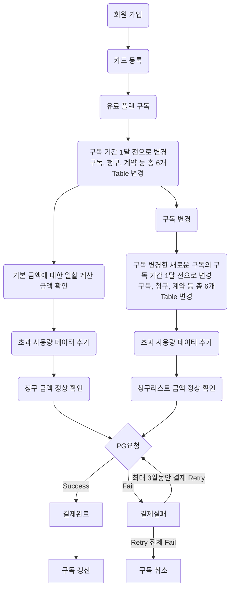
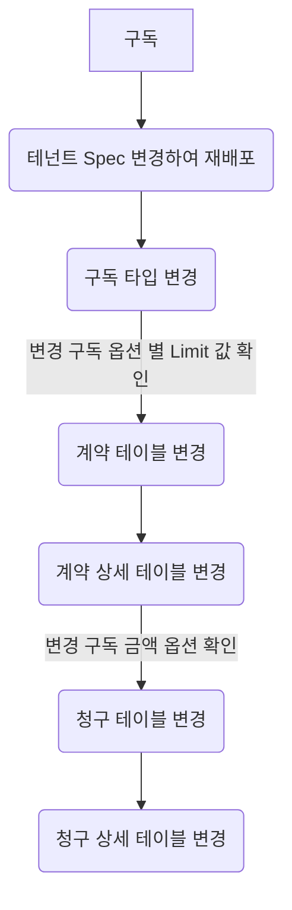
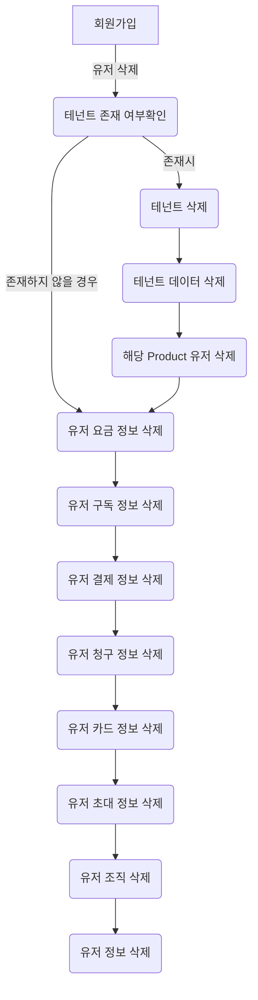
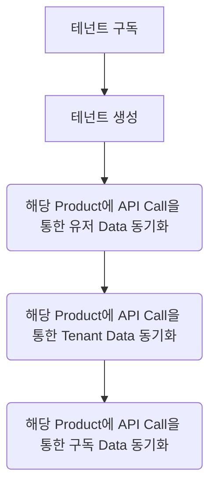

# career-architecture
> mermaid로 작성된 과제는 마크다운 파일(ARCHITECTURE.md)로 올려주시면 됩니다. (md 파일 내에 기존 구조를 넣어주세요) 
> 별도 아키택쳐나 모델링 도구를 사용한 경우에는 마크다운 파일(ARCHITECTURE.md)과 png, gif, jpg, pdf 파일 형식으로 architecture-{gitID}.png 파일명으로 upload 해주세요
# 요구사항
- [x] 담당 하는 업무에서 비효율적인 프로세스나 기술적 개선을 하고 싶은 부분의 현재 구조를 문서화 한다.
    - [x] 비효율적인 부분에 대한 분석내용을 정리한다.
    - [x] 비효율적인 부분에 대한 프로세스 또는 시스템 구조를 그려본다.

## 🚀미션
- 이름 : 이정수
### 개선포인트 분석
#### 개발, 테스트 프로세스 개선 포인트
1. QA 팀에서 테스트 시 결제/금액 관련 항목에 데이터를 넣기 위하여 해당 QA시 개발자와 함께 해당 항목 테스트를 위한 데이터를 수동으로 만든다.
   1. 직전 월의 청구 금액을 익월 1일에 청구 금액 확정을 하고 익월 5일에 결제하는 구조를 갖고 운영하고 있기 때문에 구독 월을 직전 월로 변경해야 함
   2. 구독 변경이 하루에 한 번 가능하기 때문에 해당 로직을 피하기 위하여 구독을 하루 전으로 데이터 임의 조정 하고 구독 변경 테스트를 해야 함
   3. 월별 기본금액에 대한 일할 계산 (사용일 / 해당 월의 일 수)이 필요하기 때문에 금액 계산을 위하여 여러 테이블의 데이터를 맞춰야 함
   4. 제공 가능한 최대 사용량을 초과 할 경우에 대한 초과 사용량 금액 계산을 위하여 사용량을 수동으로 DB에 추가하여 금액 계산
2. 영업을 통한 고객일 경우 기존 구독 프로세스와 별도로 DB 데이터를 수동 조작하여 원하는 플랜 구독하는 형태로 변경한다.
3. Back-End 자체적인 테스트 코드 이외의 개발팀 내부 테스트 (Front UI, Full Test ...)를 반복 하기 위하여 데이터 삭제가 필요한 상황에서 데이터를 수동 삭제하는 경우가 발생한다.

#### 아키텍처 개선 포인트
1. 플랫폼과 플랫폼에서 사용 가능한 제품이 같은 데이터를 갖고 있어야 하는 상황이라 동기화가 중요한데, 동기화 실패 시 해당 데이터의 정합성을 보장할 아키텍처가 필요 
 
### 프로세스
#### 프로세스 개선 포인트 1. 프로세스

#### 프로세스 개선 포인트 2. 프로세스

#### 프로세스 개선 포인트 3. 프로세스

#### 아키텍처 개선 포인트 1. 프로세스

