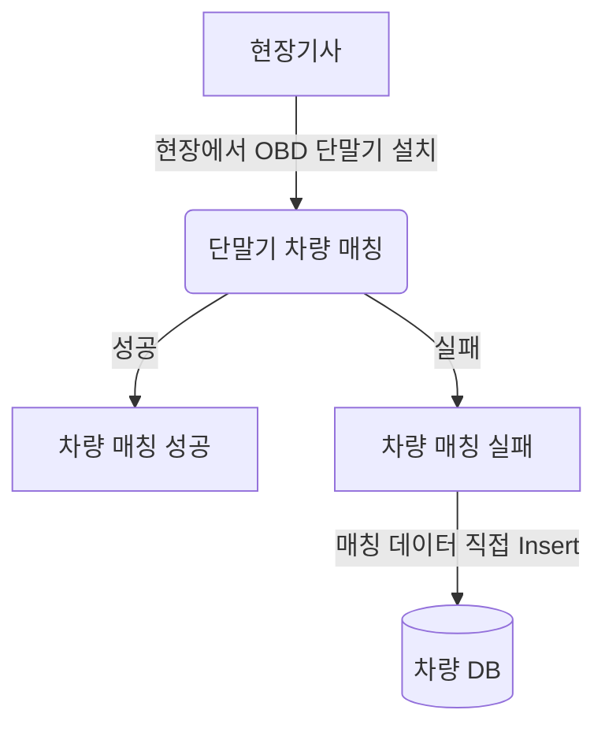

# career-architecture
> mermaid로 작성된 과제는 마크다운 파일(ARCHITECTURE.md)로 올려주시면 됩니다. (md 파일 내에 기존 구조를 넣어주세요) 
> 별도 아키택쳐나 모델링 도구를 사용한 경우에는 마크다운 파일(ARCHITECTURE.md)과 png, gif, jpg, pdf 파일 형식으로 architecture-{gitID}.png 파일명으로 upload 해주세요
# 요구사항
- [x] 담당 하는 업무에서 비효율적인 프로세스나 기술적 개선을 하고 싶은 부분의 현재 구조를 문서화 한다.
    - [x] 비효율적인 부분에 대한 분석내용을 정리한다.
    - [x] 비효율적인 부분에 대한 프로세스 또는 시스템 구조를 그려본다.

## 🚀미션
- 이름 : 조영훈
### 개선포인트 분석
- 차량에 OBD 단말기를 설치하기 위해 차량이 있는 현장에 설치 기사가 현장 출동을 한다.
- 설치 기사가 단말기를 차량에 설치하고 연동을 하기 위해 설치 프로세스를 진행한다.
- 차량이 주차 되 있는 곳이 1층 이거나 탁 트인 주차랑의 경우에는 설치 프로세스를 진행 할 때는 설치가 잘 진행된다. 
- 그러나 종종 단말기와 서버가 통신이 잘 되지 않는 지하 주차장인 경우가 종종 있다.
- 이러한 경우에는 단말기와 서버가 연동이 제대로 되지 않아, 물리적 설치만(단말기와 차량) 진행한다.
- 그 이후 단말기를 서버와 연동하기 위해 연동에 필요한 단말기 정보 및 차량 데이터를 SQL로 DB 넣는 업무 비용이 발생한다.
- 이를 간단하게 관리자 화면에 API 만들어서 간단하게 입력 및 버튼으로 비용을 줄일 것으로 기대된다.
 
### 프로세스

