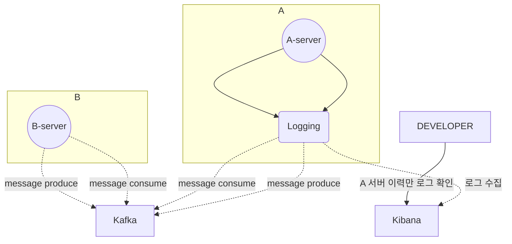
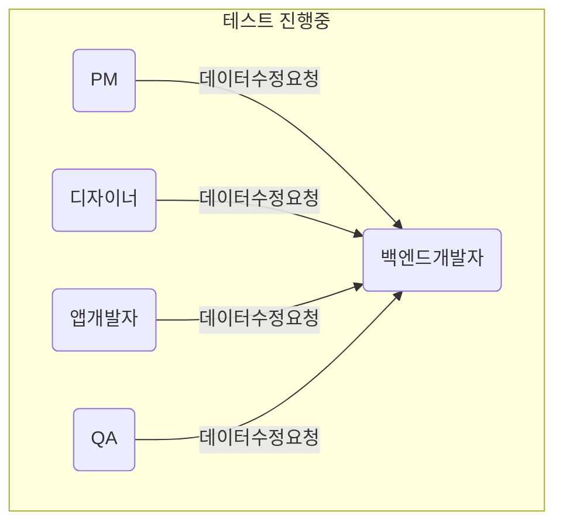
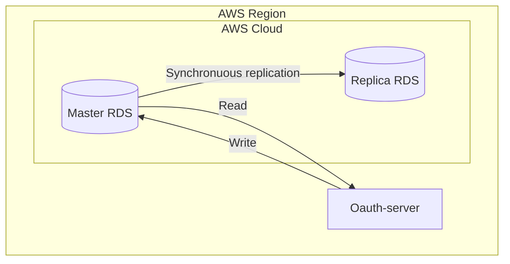

# 🚀미션

- 이름 : 윤영빈

# 개선포인트 분석

## #1

- 각 서버들마다 비동기 데이터 요청은 카프카를 사용하고 있음
- 카프카 프로듀싱, 컨슘 관련 로그를 남기고 있지 않은 서버가 존재
- 카프카 UI 툴에서 확인 하지만 이마저도 retention 시간이 지나면 사라져 버리니 확인하기 어려움
- 또는 데이터 삽입 혹은 갱신 시간(updatedAt) 으로 확인하지만 정확하지 않음
- 그라파나로 모니터링은 가능하지만 어떤 메시지가 전달되었는지 확인하기 어려움
- 키바나에서 필터조건으로 로그 검색이 어려움

## #2

- 내부 테스트 진행시 필요한 (QA) api 를 제공하고있으나 api 를 호출할 툴(ex. postman)이 구성되어있지 않은 비개발자들은 매번 개발팀 또는 QA 에게 요청
- 호출 플랫폼을 구성한다해도 낯선 용어들과 UI 로 매번 개발자들이 결국 도와주게 됨
- 테스트 API 의 대한 문서를 노션으로 제공하고 있지만 호출하기 위해 구성해야하는 것들이 어렵게 느껴질 수 있음.
- 테스트 API 의 존재도 모르는 분들이 계시기 때문에 결국 BE 개발자가 직접 API 를 호출하거나 데이터를 수정함

## #3

- 현재 인증서버에서는 master database 만 사용하고 있다.
- read / write 엔드포인트가 2:8 정도의 비율 (cud 엔드포인트가 더 많다.)
- 로그인할 때마다 데이터 업데이트를 하고 있고 로그인 요청이 몰리는 시간대에 잘 사용하고 있던 클라이언트에게 영향이 갈 수 있음
- 슬로우 쿼리등의 이슈가 있을 때마다 트래픽이 증가하면 서버에 엄청난 부하를 주게됨 (실제로 인덱스 하나 서버가 죽는 장애가 발생한 적이 있음)
- 새벽마다 운전면허 인증 재갱신 혹은 회원삭제등 상태를 변경하는 작업들이 대량으로 이루어질 때 서버나 DB 의 부하가 우려됨
- 확인해 보니 replica rds 가 실제로 존재하고 있으나 (sre 팀에서 기본으로 구성해뒀음) 활용하지 못하고 있었음

# 프로세스

## #1 카프카 프로듀싱, 컨슘 로그의 부재

## #2 QA 혹은 새니티 테스트를 위한 데이터 수정 요청

## #3 master db 만 사용

