```mermaid
flowchart TD
	Kafka

	subgraph A
		A-server(("A-server"))
		Logging_A("Logging")
	end 

	A-server --> Logging_A -. message produce .-> Kafka
	A-server --> Logging_A -. message consume .-> Kafka

	subgraph B
		B-server(("B-server"))
	end

	B-server -. message consume .-> Kafka
	B-server -. message produce .-> Kafka

	Kibana
	Logging_A -. 로그 수집 .-> Kibana

	DEVELOPER -- A 서버 이력만 로그 확인 --> Kibana
	
```

# 🚀미션

- 이름 : 윤영빈

# 개선포인트 분석

## ~~# 카프카 프로듀싱, 컨슘 로그의 부재 (제외 (실무에서 적용 완료))~~

- 각 서버들마다 비동기 데이터 요청은 카프카를 사용하고 있음
- 카프카 프로듀싱, 컨슘 관련 로그를 남기고 있지 않은 서버가 존재
- 카프카 UI 툴에서 확인 하지만 이마저도 retention 시간이 지나면 사라져 버리니 확인하기 어려움
- 또는 데이터 삽입 혹은 갱신 시간(updatedAt) 으로 확인하지만 정확하지 않음
- 그라파나로 모니터링은 가능하지만 어떤 메시지가 전달되었는지 확인하기 어려움
- 키바나에서 필터조건으로 로그 검색이 어려움

## ~~# QA 혹은 새니티 테스트를 위한 데이터 수정 요청 (제외)~~

- 내부 테스트 진행시 필요한 (QA) api 를 제공하고있으나 api 를 호출할 툴(ex. postman)이 구성되어있지 않은 비개발자들은 매번 개발팀 또는 QA 에게 요청
- 호출 플랫폼을 구성한다해도 낯선 용어들과 UI 로 매번 개발자들이 결국 도와주게 됨
- 테스트 API 의 대한 문서를 노션으로 제공하고 있지만 호출하기 위해 구성해야하는 것들이 어렵게 느껴질 수 있음.
- 테스트 API 의 존재도 모르는 분들이 계시기 때문에 결국 BE 개발자가 직접 API 를 호출하거나 데이터를 수정함

## #1 master db 만 사용

- 현재 인증서버에서는 master database 만 사용하고 있다.
- read / write 엔드포인트가 2:8 정도의 비율 (cud 엔드포인트가 더 많다.)
- 로그인할 때마다 데이터 업데이트를 하고 있고 로그인 요청이 몰리는 시간대에 잘 사용하고 있던 클라이언트에게 영향이 갈 수 있음
- 슬로우 쿼리등의 이슈가 있을 때마다 트래픽이 증가하면 서버에 엄청난 부하를 주게됨 (실제로 인덱스 하나 서버가 죽는 장애가 발생한 적이 있음)
- 새벽마다 운전면허 인증 재갱신 혹은 회원삭제등 상태를 변경하는 작업들이 대량으로 이루어질 때 서버나 DB 의 부하가 우려됨
- 확인해 보니 replica rds 가 실제로 존재하고 있으나 (sre 팀에서 기본으로 구성해뒀음) 활용하지 못하고 있었음

## #2 시간제 보험 유효기간 수동 조정 (추가) 

- 시간제 보험에 가입되어 있는 라이더가 존재한다.
- 보험 해지는 직접 보험사 페이지에서 신청 혹은 유선 전화로 신청하고 우리쪽 서버로 만료 콜백을 받는다. 
- 하지만 바로 만료 콜백을 주지 않는 상황이며 (보험제휴사 사정) 라이더는 만료 신청 후에도 보험료가 부과될 수 있다.(해지 시점을 기준으로 부과된 보험료는 청구되지 않는다.)
- 추후 조치로 보험료가 부과되지는 않지만 CX 쪽으로 불편사항이 접수되어 개발자가 수동으로 유효기간을 만료 시키고 있다.
- 유효기간을 만료시키기 위해 해당 라이더의 개인정보를 받아야하며 약간의 커뮤니케이션 비용이 발생한다. (CX -> PM -> DEVELOPER)
- 위와 같은 요청이 일주일에 1~2 건 정도 발생한다.
- 탈퇴 회원에 대해서도 별도의 유효기간 종료 액션을 취하지 않기 때문에 (최대 2달 회원 삭제 유효기간 존재) 해지 신청을 했음에도 라이더가 보험 만료를 확인하지 못하면 CX 에 요청하여
  위와 같은 커뮤니케이션을 거쳐 수동으로 유효기간 만료로 상태를 업데이트 해주고 있다.
- 한 건당 개인정보 조회, 수정, 수정 확인 약 15분 정도의 고정 비용이 발생하고 있다.

# 프로세스

## ~~# 카프카 프로듀싱, 컨슘 로그의 부재 (제외 (실무에서 적용 완료))~~



## ~~# QA 혹은 새니티 테스트를 위한 데이터 수정 요청 (제외)~~

```mermaid
flowchart TD	
	subgraph 테스트 진행중
		TESTER_A("PM") -- 데이터수정요청 --> BE
		TESTER_B("디자이너") -- 데이터수정요청 --> BE
		TESTER_C("앱개발자") -- 데이터수정요청 --> BE
		TESTER_D("QA") --데이터수정요청 --> BE
		BE("백엔드개발자")
	end
```

## #1 master db 만 사용


## #2 시간제 보험 유효기간 수동 조정 (추가)

```mermaid
flowchart TD
    라이더 -- 보험해지요청 --> 보험사
    라이더 -- 만료 상태 변경 요청 --> CX팀
	CX팀 --> PM
    PM --> DEVELOPER
    DEVELOPER -- 수동 상태 변경 --> DB[(DB)]
```