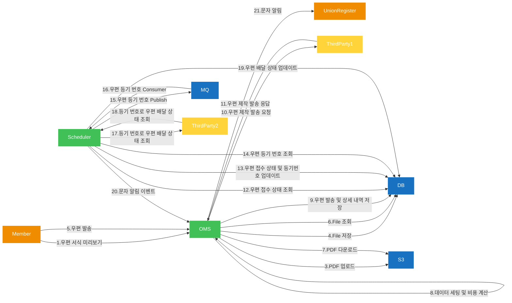

# career-architecture
> mermaid로 작성된 과제는 마크다운 파일(ARCHITECTURE.md)로 올려주시면 됩니다. (md 파일 내에 기존 구조를 넣어주세요) 
> 별도 아키택쳐나 모델링 도구를 사용한 경우에는 마크다운 파일(ARCHITECTURE.md)과 png, gif, jpg, pdf 파일 형식으로 architecture-{gitID}.png 파일명으로 upload 해주세요
# 요구사항
- [ ] 담당 하는 업무에서 비효율적인 프로세스나 기술적 개선을 하고 싶은 부분의 현재 구조를 문서화 한다.
    - [ ] 비효율적인 부분에 대한 분석내용을 정리한다.
    - [ ] 비효율적인 부분에 대한 프로세스 또는 시스템 구조를 그려본다.

## 🚀미션
- 이름 : 김재현
### 개선포인트 분석
- DTO, VO, Entity 혼용되어 하나의 클래스에 너무 많은 책임이 부여되어 있음
- PDF 변환 작업시 setter의 무분별한 사용으로 인해 어떤 부분에서 데이터가 변하는지 파악하기 어려움
- 우편 접수 실패시 처리 필요
- 불필요한 RabbitMQ 사용

### 프로세스

