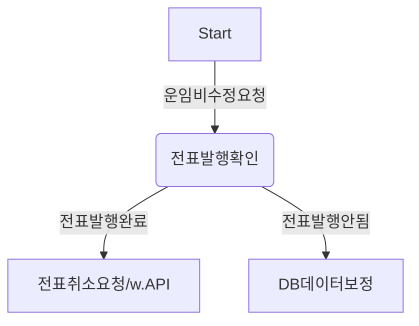

# career-architecture

# 요구사항

-   [x] 담당 하는 업무에서 비효율적인 프로세스나 기술적 개선을 하고 싶은 부분의 현재 구조를 문서화 한다.
    -   [x] 비효율적인 부분에 대한 분석내용을 정리한다.
    -   [x] 비효율적인 부분에 대한 프로세스 또는 시스템 구조를 그려본다.

## 🚀미션

-   이름 : 김호섭

### 개선포인트 분석

-   운영 이슈 티켓으로 제일 많이 올라오는 건이 운임비 수정 건입니다. 하루에 올라오는 운영 이슈 중 50% 비율을 차지하고 있습니다.
-   해당 이슈가 티켓으로 올라오면 전표가 발행된 주문인지 확인합니다.
-   전표가 발행된 주문은 전표 취소 API를 통해서 전표를 취소합니다.
-   전표가 발행되지 않은 주문은 DB 데이터를 수동으로 수정합니다.
-   이렇게 수동으로 수정하는 작업이 주문의 개수에 따라 많게는 30분까지 걸립니다.
-   이렇게 리소스가 많이 드는 작업을 API를 통해 어드민 페이지에서 기능을 제공하거나 테스트 코드를 만들면 비용을 많이 줄일 수 있으 것으로 예상됩니다.

### 프로세스

