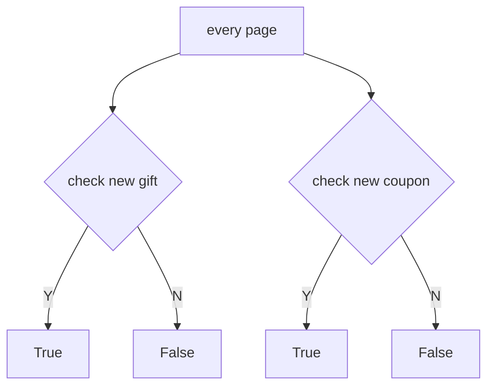

# career-architecture
> mermaid로 작성된 과제는 마크다운 파일(ARCHITECTURE.md)로 올려주시면 됩니다. (md 파일 내에 기존 구조를 넣어주세요) 
> 별도 아키택쳐나 모델링 도구를 사용한 경우에는 마크다운 파일(ARCHITECTURE.md)과 png, gif, jpg, pdf 파일 형식으로 architecture-{gitID}.png 파일명으로 upload 해주세요
# 요구사항
- [ ] 담당 하는 업무에서 비효율적인 프로세스나 기술적 개선을 하고 싶은 부분의 현재 구조를 문서화 한다.
    - [ ] 비효율적인 부분에 대한 분석내용을 정리한다.
    - [ ] 비효율적인 부분에 대한 프로세스 또는 시스템 구조를 그려본다.

## 🚀미션1
- 이름 : 주환석
### 개선포인트 분석
- 새로운 선물, 쿠폰이 있는지 여부를 조회하는 api를 호출하는 로직에 대한 개선이 필요함.
- 현재 모든 페이지에서 호출된다.
- 모니터링 툴을 통해 확인해본 결과 서비스에서 가장 많이 호출되는 api 1,2위이다.
- 실시간으로 유저에게 알림을 주기위해 자주 호출하고 있다. 
- 호출량에 따른 누적 처리 시간도 가장 긴 편이다.
- 서버에 부하를 줄 수 있는 포인트이기 때문에 개선이 필요해 보임.
 
### 프로세스

- architecture-couponNew.jpg 참고
