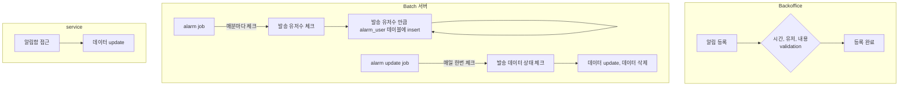

# career-architecture
> mermaid로 작성된 과제는 마크다운 파일(ARCHITECTURE.md)로 올려주시면 됩니다. (md 파일 내에 기존 구조를 넣어주세요) 
> 별도 아키택쳐나 모델링 도구를 사용한 경우에는 마크다운 파일(ARCHITECTURE.md)과 png, gif, jpg, pdf 파일 형식으로 architecture-{gitID}.png 파일명으로 upload 해주세요
# 요구사항
- [ ] 담당 하는 업무에서 비효율적인 프로세스나 기술적 개선을 하고 싶은 부분의 현재 구조를 문서화 한다.
    - [ ] 비효율적인 부분에 대한 분석내용을 정리한다.
    - [ ] 비효율적인 부분에 대한 프로세스 또는 시스템 구조를 그려본다.

  
## 🚀미션2
- 이름 : 주환석
### 개선포인트 분석
- 알림함 데이터 처리 프로세스
- 대상 유저수 만큼 DB insert, update, delete가 발생됨.
- 현재 배치를 이용한 처리가 불필요하다고 판단.
- 배치서버와 DB부하를 줄일 수 있는 프로세스로 개선이 필요하다고 판단.
### 프로세스

