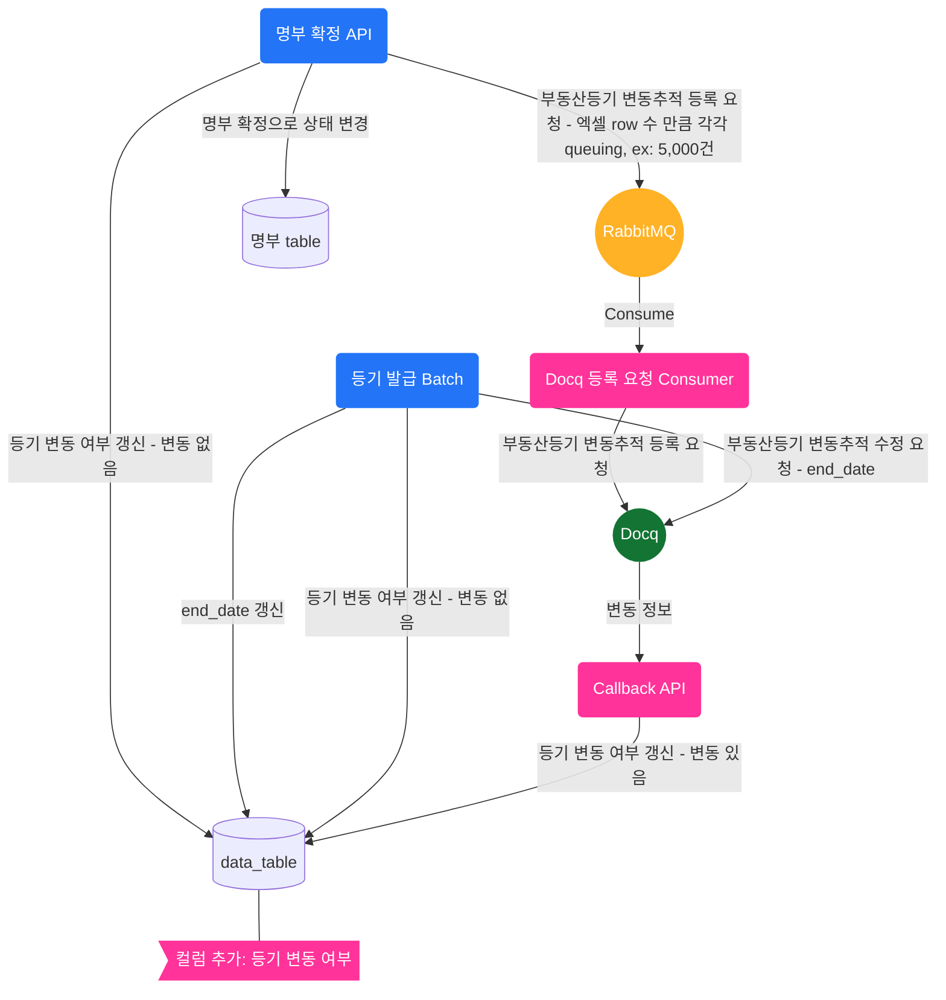

# career-architecture
> mermaid로 작성된 과제는 마크다운 파일(ARCHITECTURE.md)로 올려주시면 됩니다. (md 파일 내에 기존 구조를 넣어주세요)<br>
> 별도 아키택쳐나 모델링 도구를 사용한 경우에는 마크다운 파일(ARCHITECTURE.md)과 png, gif, jpg, pdf 파일 형식으로 architecture-{gitID}.png 파일명으로 upload 해주세요
# 요구사항
- [ ] 담당 하는 업무에서 비효율적인 프로세스나 기술적 개선을 하고 싶은 부분의 현재 구조를 문서화 한다.
    - [ ] 비효율적인 부분에 대한 분석내용을 정리한다.
    - [ ] 비효율적인 부분에 대한 프로세스 또는 시스템 구조를 그려본다.


## 🚀미션
- 이름 : 이병덕
### 개선포인트 분석
```
개선 포인트가 아닌 5월 20일부터 개발들어 갈 내용으로 잡아봤습니다. 이걸 주제로 변경하고 싶은 이유는 기존 내용보다 기술적으로 더 접근할 수 있을 것 같아서입니다.
현재 상황이 Docq라는 회사에서 그쪽 리뉴얼로 인해 20일부터 API를 저희에게 제공할 수 있다고 해서 설계만 해놓은 상태입니다.
기존 설계에서의 설계를 개선하여 20일부터 개발에 들어가는 시나리오를 생각하고 있습니다!
리뷰로 남겨주신 병렬 처리 부분에 대한 내용이 이 부분과 동일한 부분이라서 차라리 이 주제로 변경하는 것이 업무와 더 연관이 되어 변경해보려고 합니다!
```
### 프로세스
해당 프로세스는 소재지에 대해 등기소에서 등기 내용이 변동된 것이 있는지 없는지 여부를 확인하는 API이다.
등기가 변경된 내용이 있으면 "변경 있음"으로 화면에 보여주고, 해당 등기를 발급하면 "변경 없음"으로 변경된다.
이로 인해 사용자는 등기가 변경되었는지 여부를 확인할 수 있어 변경된 등기는 발급하여 확인하는 기능이다.
1. 명부 확정 시 3 ~ 5천 건 정도 데이터를 읽어 Queuing 한다.
2. dom table에 등기 변동 여부 값을 디폴트 변동 없음으로 insert한다.
3. Docq라는 등기소 Third Party에 등기 추적 요청 등록을 위해 loop를 돌며 3 ~ 5천 건을 MQ에 넣는다.
4. Consumer는 3 ~ 5천 건을 각각 Docq에 요청한다. Docq는 비동기로 처리하기 때문에 이렇게 날려도 문제가 없다고 한다.
5. Docq는 매일 변동 추적을 위해 매일 갱신한다.
6. Docq에서 Callback을 받아 등기 변동 여부를 dom table에 변동 있음으로 갱신한다.(Docq에서는 변동이 있는 등기만 응답해준다.)
7. 우리 시스템에서 변동된 등기가 있으면 직접 등기 발급 신청을 한다.
8. 등기 발급 신청은 별도의 DB에 들어간다.
9. 등기 발급 배치는 특정 DB를 읽어 4Click이라는 Third Party에서 등기 발급을 하고, dom table에 end_date를 now()로 갱신하고, 등기 변뎡 여부를 변동 없음으로 변경한다.
10. 등기 발급 배치는 end_date로 Docq에게 변동 추석 수정 요청을 한다.
- 

### 문제점
- row를 각각 Queuing하고 있다. 성능 문제가 발생할 것 같다.
- 외부 API인 Docq와 연동하는데 네트워크 문제든 뭐든 실패에 대한 문제 해결 구조가 없다.
- 위와 비슷한 맥락으로 재시도 전략과 같은 것도 없다.
- 명부 table이 Rollback이 되고, Message는 발행됐을 경우와 Commit은 됐는데 Message 발행이 실패했을 경우에 대한 고려가 없다.
- 즉, 외부 API와 연동이 제대로 되지 않았을 경우 어떻게 할 것인지에 대한 구조가 없이 무지성으로 Queuing하고 있다.
- Docq측 사정으로 5월 20일까지 기다려야하는데 대략 API 스펙은 예상되기 때문에 구조를 interface를 미리 만들어 mock으로 개발을 진행해볼 수 있을 것 같다.   
- mock으로 미리 주말에 진행해놓으면 20일에 들어갈 때 조금 더 여유가 있을 것이므로 그 때 기능을 빠르게 만들고 문제점이라고 야기한 부분을 더 고민해볼 수 있을 것 같다.