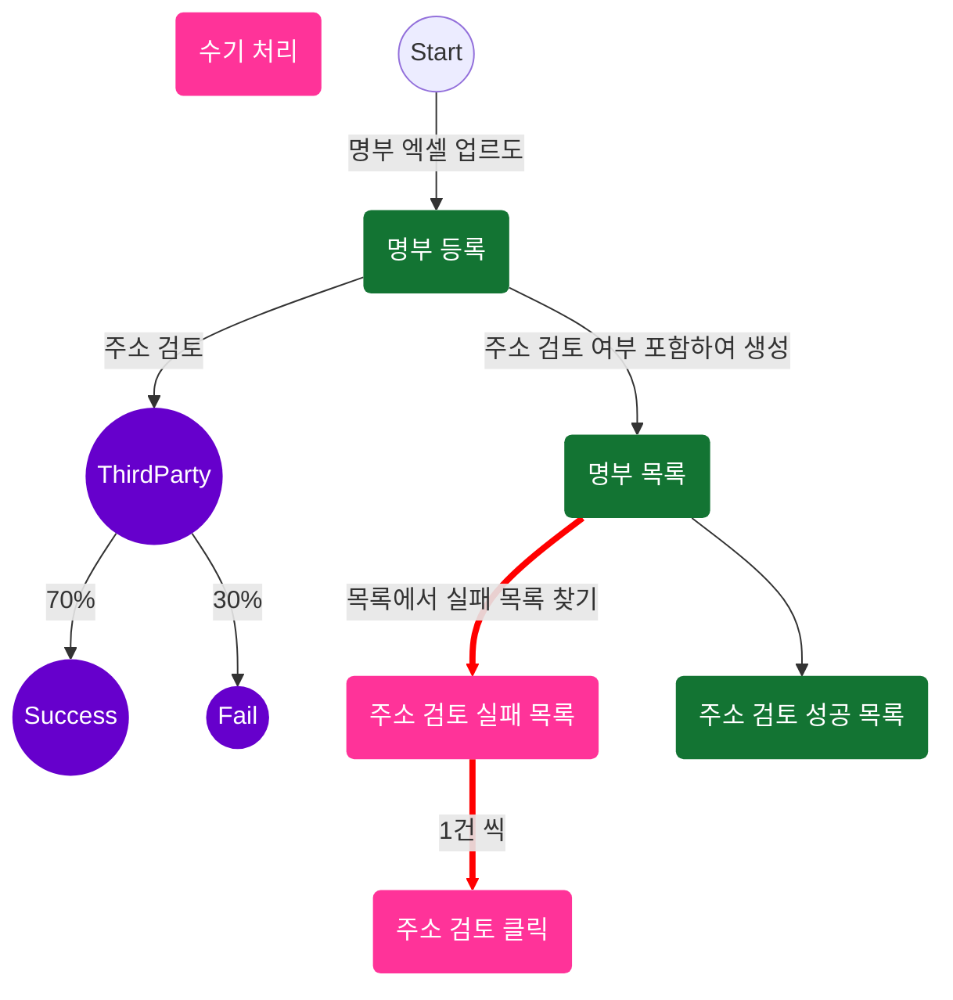
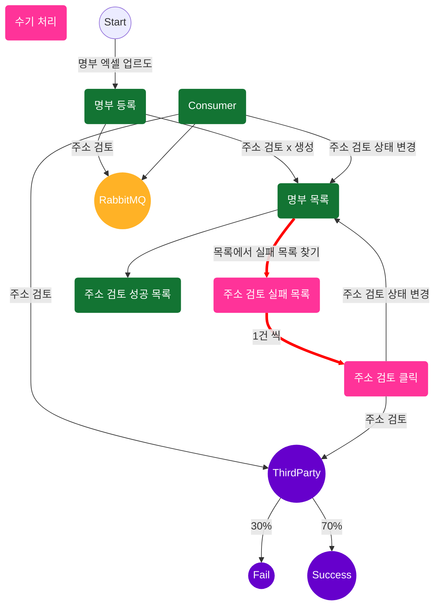

# career-architecture
> mermaid로 작성된 과제는 마크다운 파일(ARCHITECTURE.md)로 올려주시면 됩니다. (md 파일 내에 기존 구조를 넣어주세요) 
> 별도 아키택쳐나 모델링 도구를 사용한 경우에는 마크다운 파일(ARCHITECTURE.md)과 png, gif, jpg, pdf 파일 형식으로 architecture-{gitID}.png 파일명으로 upload 해주세요
# 요구사항
- [ ] 담당 하는 업무에서 비효율적인 프로세스나 기술적 개선을 하고 싶은 부분의 현재 구조를 문서화 한다.
    - [ ] 비효율적인 부분에 대한 분석내용을 정리한다.
    - [ ] 비효율적인 부분에 대한 프로세스 또는 시스템 구조를 그려본다.

## 🚀미션
- 이름 : 이병덕
### 개선포인트 분석
- CMS에서 조합원 명부 승인 시 엑셀 업로드를 하여 명부 등록한다. 이 때 주소 검토가 필수적으로 들어가는데 주소 검토 실패가 많다.
- 주소 검토 실패가 발생하여 CMS 등록된 명부 목록 중 1건씩 직접 주소 재검토를 위해 주소 검토 버튼을 해야한다.
- 주소 검토는 Third Party를 사용하는데 Third Party의 문제이다. 현재 1건씩 검토를 해도 30%확률로 실패한다.
- Third Party에서는 해결을 해주지 않는 상황으로 추후 다른 Third Party로 바꿀 예정이지만 현재는 바꾸기엔
- 만약 명부 5천 건 중 1천 건이 주소 검토를 실패하면 1건 씩 주소 검토 버튼을 클릭해야 한다.
- 현재는 유저가 많지 않아서 명부 승인할 일이 많지는 않은 상태임에도 매번 승인 시 마다 재검토 시간으로 1시간이 낭비된다.
- 앞으로 유저가 많아지면 하루에도 몇 번씩 명부 승인을 할텐데 수 시간으로 늘어날 것이다.

### 프로세스

### 시스템 프로세스
