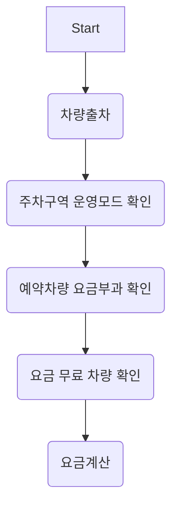

# 요구사항
- [ ] 담당 하는 업무에서 비효율적인 프로세스나 기술적 개선을 하고 싶은 부분의 현재 구조를 문서화 한다.
    - [ ] 비효율적인 부분에 대한 분석내용을 정리한다.
    - [ ] 비효율적인 부분에 대한 프로세스 또는 시스템 구조를 그려본다.


## 🚀미션
- 이름 : 배선교
### 개선포인트 분석
- 절차지향적 프로그래밍으로 코드를 분석할 때 많은 시간이 소요된다.
- 디자인패턴이 전혀 적용되어 있지 않아 중복코드와 수 많은 if문으로 인하여 코드가 복잡하다.
- Controller에 비즈니스 로직이 섞여 있어 중복코드가 많이 발생한다.
- 가장 복잡한 요금계산 로직부터 디자인패턴을 적용하여 개선

### 프로세스


```mermaid
flowchart TB
    A[요금계산] --> B(요금그룹에 맞게 요금그룹 설정)
    B --> C(정기차량 확인)
    C --> D(요금 부과 옵션 확인)
    D --> E(요금 계산 날짜 확인)
    E --> F(요금 계산 옵션과 날짜에 따라 일별로 쪼개서 날짜 생성)
    F --> G(정기권 적용 시간 제외 날짜 생성)
    G --> H(요금 계산할 날짜 존재 유무 확인)
    H --> I(요금그룹 및 항목으로 요금시간 생성)
    I --> J(요금 계산)
    J --> K(예약차량 포인트 사용 확인)
    K --> L(영업용 무료 차량 확인)

