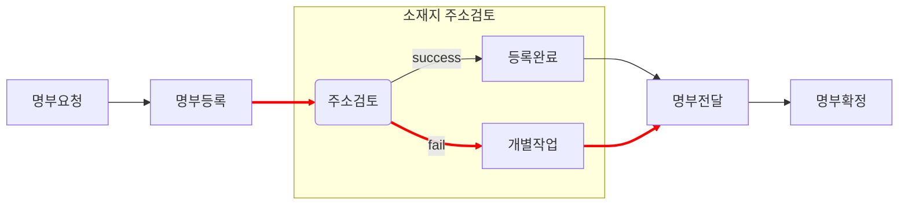
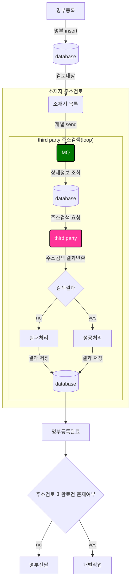

## 🚀미션
- 이름 : 박경민

### 개선포인트 분석
```text
<기본전제>
- 명부등록시 third party를 통한 소재지 주소검토가 필수로 완료되어야 한다.
- third party 자체 이슈로 소재지 주소검토 실패율이 높지만 현재 third party 측 개선은 현재 불가하다.
- 우리 서비스 로직에 우선 포커싱하여 개선해본다. 
```

```text
<문제상황>
1. 소재지 주소검토시 실패 확률이 높다.
- third party쪽에서 한꺼번에 많은 메시지를 처리하지 못하는 것 같다.
2. 소재지 주소검토 실패건이 하나라도 존재할 경우, 개별작업이 필요하다.
- 기개발된 단건 소재지 주소검토 기능을 통해 일일히 주소검토를 진행한다(기획팀/개발팀 담당자 함께 야근!)
3. 성능 이슈에 대한 우려가 있다.
- 주소검토 목록(조합별 평균 약 5000건)을 대상으로 loop 돌며 단건 처리되고 있다.
- MQ send시 주소검토 목록수에 해당하는 메시지가 한꺼번에 쌓인다.
- MQ consume시에도 불필요한 db connection이 지속적으로 발생한다.
- 에러 트래킹도 어렵다.
```

```text
<개선방향>
- MQ send 및 consume 방식에 대한 개선을 통해 아래 목적을 달성해본다.
    - third party 로의 한꺼번의 요청 부하를 줄인다.
    - 데이터 bulk 처리 등을 통해 db connection 을 줄인다.
    - 에러 트래킹을 위해 로깅을 개선한다.   
```

### AS-IS 명부등록 프로세스(요약)


### AS-IS 명부등록 프로세스(상세)

