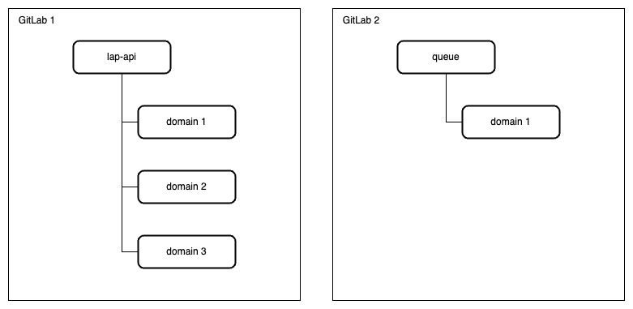
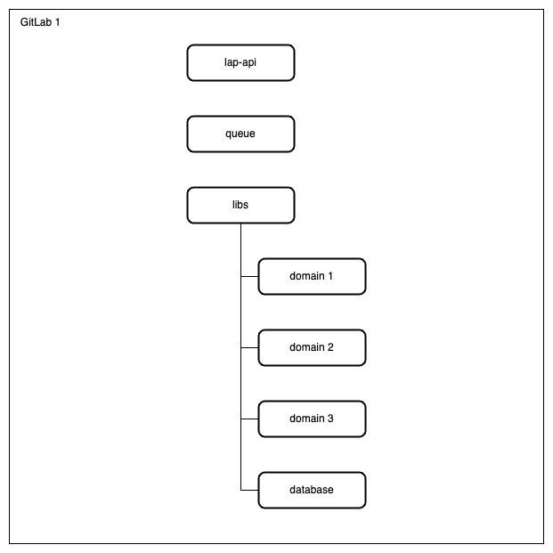

# career-architecture

> mermaid로 작성된 과제는 마크다운 파일(ARCHITECTURE.md)로 올려주시면 됩니다. (md 파일 내에 기존 구조를 넣어주세요)

> 별도 아키택쳐나 모델링 도구를 사용한 경우에는 마크다운 파일(ARCHITECTURE.md)과 png, gif, jpg, pdf 파일 형식으로 architecture-{gitID}.png 파일명으로 upload 해주세요

# 요구사항

- [x] 담당 하는 업무에서 비효율적인 프로세스나 기술적 개선을 하고 싶은 부분의 현재 구조를 문서화 한다.
    - [x] 비효율적인 부분에 대한 분석내용을 정리한다.
    - [x] 비효율적인 부분에 대한 프로세스 또는 시스템 구조를 그려본다.

## 🚀미션

- 이름 : 이상원

### 개선포인트 분석

- 백엔드 개발자가 api server 와 queue 코드 모두를 작업하지만 레포지토리가 분리되어 있어서 불편함이 있다.

- admin 을 포함한 다른 서비스가 확장될 것인데 현재와 같이 레포지토리를 계속 분리하게 된다면 관리가 힘들 것이다.

- 분리된 레포지토리에서 같은 도메인 로직을 중복해서 사용하는 경우가 발생하고 있다.
 
### 프로세스

- 모노 레포지토리로 변경하여 하나의 코드 베이스로 통합한다.

- 멀티 모듈 구조로 아키텍처를 변경하면 현재보다 더 좋은 확장성을 갖게 되고 추후 MSA 적용 시에도 모듈화 되어있는 코드가 있기 때문에 더 쉽게 적용할 수 있다.

- 각 도메인을 라이브러리화 하여 공통으로 사용할 수 있게 만들어 코드 중복을 줄일 수 있다.

- 변경 전

- 변경 후

