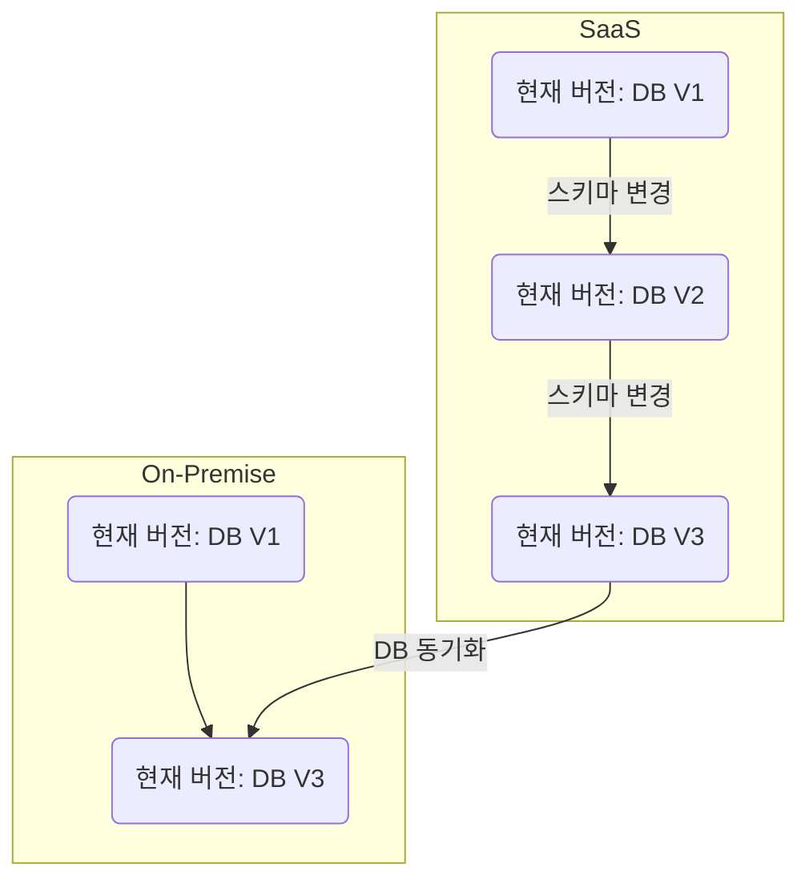

# career-architecture

# 요구사항
- [x] 담당 하는 업무에서 비효율적인 프로세스나 기술적 개선을 하고 싶은 부분의 현재 구조를 문서화 한다.
    - [x] 비효율적인 부분에 대한 분석내용을 정리한다.
    - [x] 비효율적인 부분에 대한 프로세스 또는 시스템 구조를 그려본다.

## 🚀미션
- 이름 : 정요한

### 개선포인트 분석
- On-Premise와 Saas 환경이 있다.
- Saas 환경의 경우 자주 스키마가 변경되며 Saas DB의 스키마가 변경될 때 On-Premise DB의 스키마는 변경되지 않는다
- Saas DB 스키마 변경 시 추후 On-Premise DB와 동기화를 위해 스키마 변동 사항이 버전 별로 관리되어야 하는데
  구글 Docs에다 변경 사항을 기록하는 정책이 있지만 스키마 변경 후에 기록하지 않는 경우가 많으며 스키마 변경을 기록한다고 하더라도
  API, 코어 버전 태그를 기입하지 않고 있어 API, 코어, DB의 최신 버전으로만 동기화가 가능하다 
- On-Premise 버전 업데이트를 하기 위해서는 모든 테이블의 스키마를 비교해야 하는 상황이어서
  별도의 DB 마이그레이션 툴을 사용하도록 변경하지 않는다면 수백개의 테이블을 비교해야 해서 최소 1일 이상의 리소스가 소요된다. 
- 스키마 변경 시에는 해당 스키마 변경될 때의 여러 프로젝트의 태그가 잘 관리되어야 한다.
- 스키마 변경과 관련된 API 버전 또는 코어 버전 등의 관리가 되어야 한다.
- DB 마이그레이션 툴을 사용해서 On-Premise 버전에 적용하는 식으로 변경되어야 한다.
 
### 프로세스

