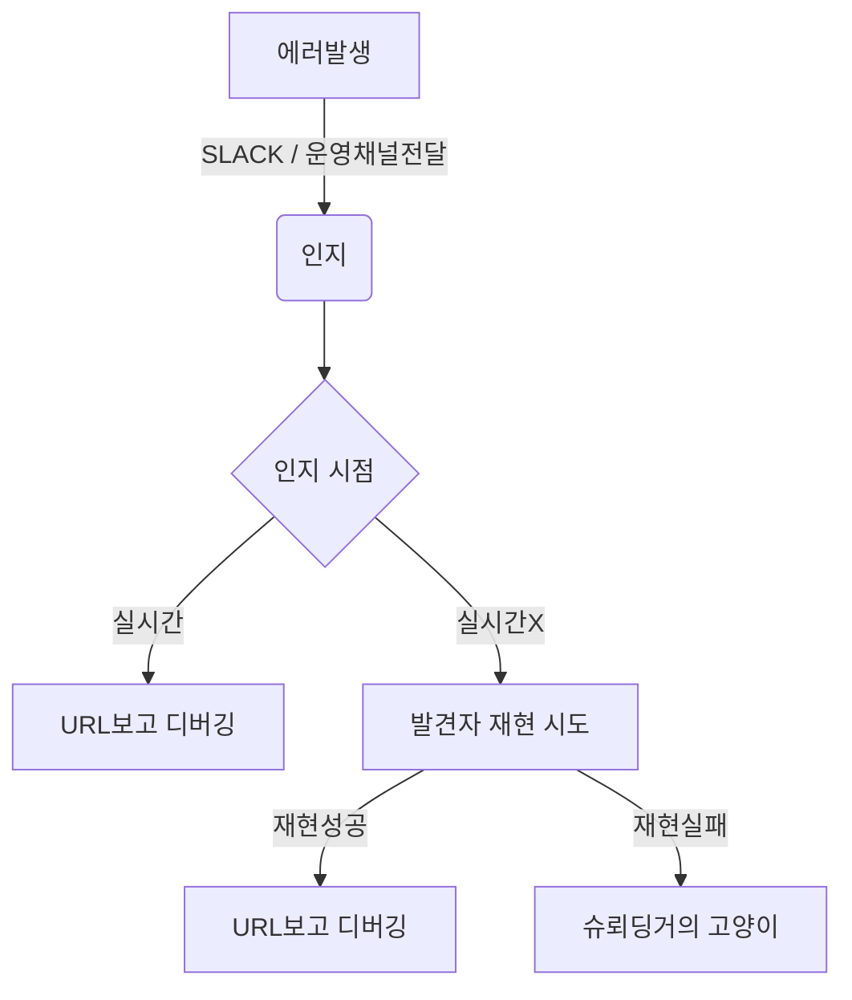
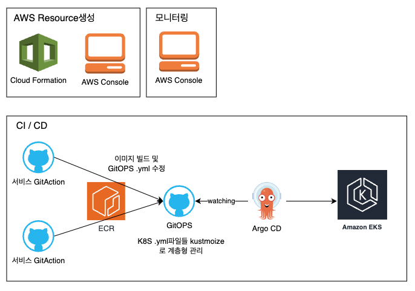
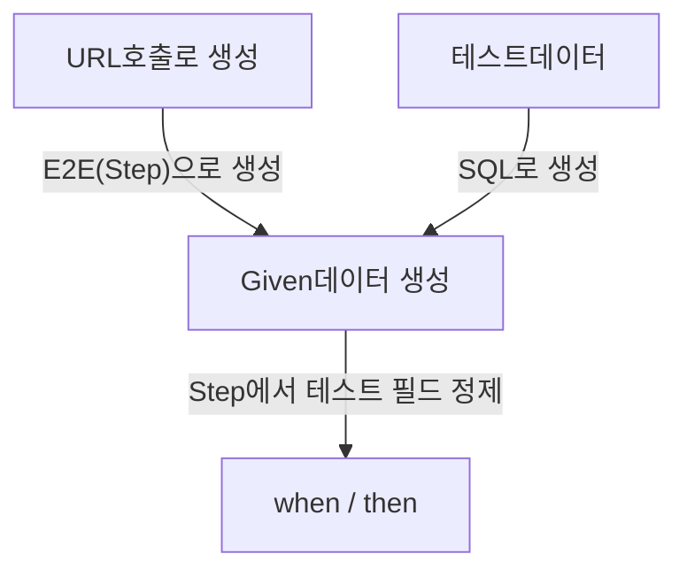

# career-architecture
> mermaid로 작성된 과제는 마크다운 파일(ARCHITECTURE.md)로 올려주시면 됩니다. (md 파일 내에 기존 구조를 넣어주세요)  
> 별도 아키택쳐나 모델링 도구를 사용한 경우에는 마크다운 파일(ARCHITECTURE.md)과 png, gif, jpg, pdf 파일 형식으로 architecture-{gitID}.png 파일명으로 upload 해주세요
# 요구사항
- [x] 담당 하는 업무에서 비효율적인 프로세스나 기술적 개선을 하고 싶은 부분의 현재 구조를 문서화 한다.
    - [x] 비효율적인 부분에 대한 분석내용을 정리한다.
    - [x] 비효율적인 부분에 대한 프로세스 또는 시스템 구조를 그려본다.

## 🚀미션
- 이름 : 최창훈

# 제안 1
### 개선포인트 분석
- 운영 서버 에러 인지 및 로그
  - 인지
    - 5** error만 slack 알림으로 받고있다 + 알림 내용은 URL만 받고있다.
    - 에러 발견자가 운영채널로 올린다.
  - 로그
    - 메인 서비스는 vercel의 serverless로 배포되고 있다.
      - https://vercel.com/docs/functions/serverless-functions
      - 로그는 최대 하루 저장된다.
    - 최근 서비스들은 EKS로 띄운다.
      - 로그는 저장하고 있지 않다.
- 실시간으로 오류가 발생한 것이 아니면 로그를 확인할 수 없다.
- 실시간으로 나오는 로그도 stack trace가 없고 개발자가 입력한 메시지만 나온다. 
- 예외처리가 고도화 되어있지 않고, 대부분 4**에러로 보낸다.
- 예외처리 고도화 및 시스템로그 적재가 필요하다고 생각

### 프로세스

# 제안 2
### 개선포인트 분석
- EKS DEPLOY 고도화 및 모니터링 툴 도입
  - AWS 환경 구축은 CloudFormation, Console, CLI가 섞여있다.
  - EKS 빌드는 ArgoCD로 배포하며, GitOps는 Kustomize로 구성되어있다.
  - 모니터링은 AWS의 Console에 의존한다.
- 내년에 멀티클라우드 서비스 전환예정이기 때문에 특정 클라우드에 종속되지 않는 IaC가 필요
- 모니터링 고도화 필요

### 기술적용 아키텍처

# 제안 3
### 개선포인트 분석
- 현재 E2E는 Step(URL호출 및 특정 필드 추출 함수), Fixture를 두어서 테스트 가독성을 높이고있다.
  - 그럼에도 불구하고 E2E 테스트의 가독성이 아쉬울 때가 있다.
  - Step의 경계선이 애매하기에 정리가 필요하다.
  - Step을 통해서 데이터를 Given하지만, 직접 SQL로 데이터를 넣는 것이 편리한 테스트도 존재한다.
### 프로세스

