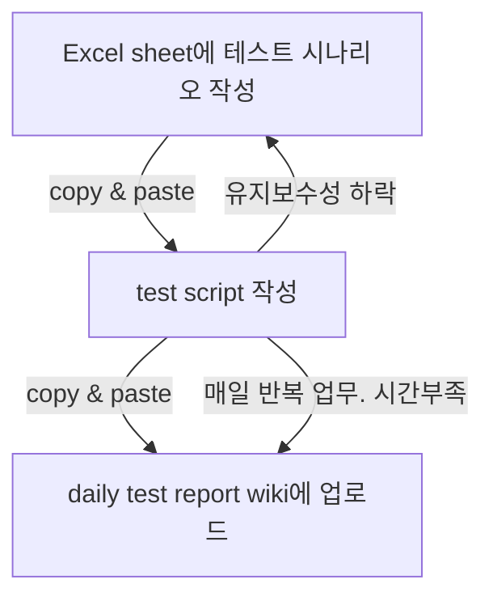
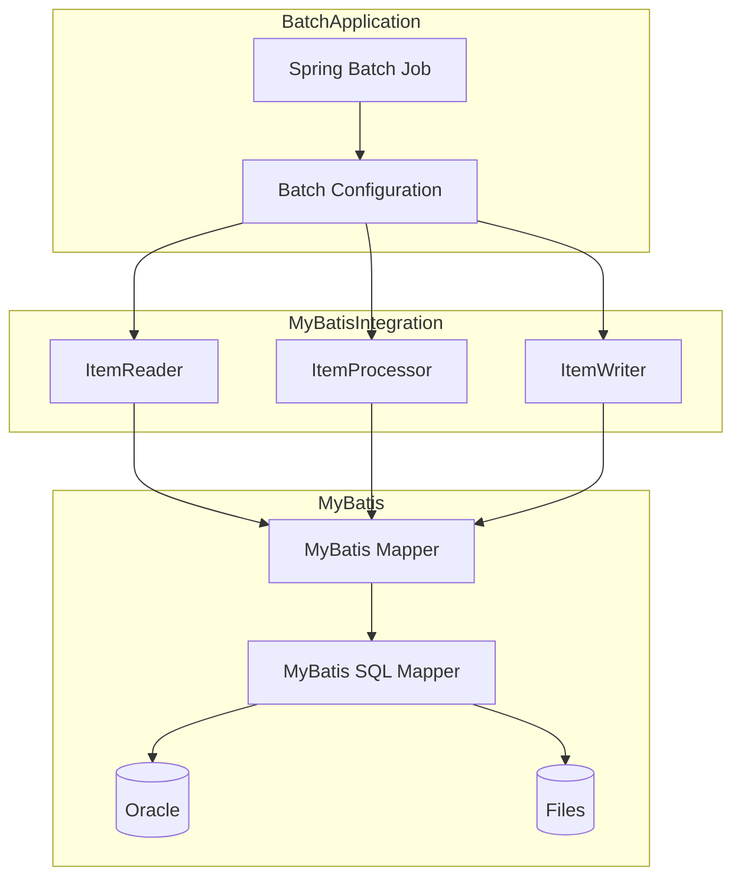

# career-architecture
> mermaid로 작성된 과제는 마크다운 파일(ARCHITECTURE.md)로 올려주시면 됩니다. (md 파일 내에 기존 구조를 넣어주세요) 
> 별도 아키택쳐나 모델링 도구를 사용한 경우에는 마크다운 파일(ARCHITECTURE.md)과 png, gif, jpg, pdf 파일 형식으로 architecture-{gitID}.png 파일명으로 upload 해주세요
# 요구사항
- [ ] 담당 하는 업무에서 비효율적인 프로세스나 기술적 개선을 하고 싶은 부분의 현재 구조를 문서화 한다.
    - [ ] 비효율적인 부분에 대한 분석내용을 정리한다.
    - [ ] 비효율적인 부분에 대한 프로세스 또는 시스템 구조를 그려본다.

## 🚀미션
- 이름 : 김도연
### 개선포인트 분석 (1)
- 테스트 시나리오를 작성할 때마다 기존의 비슷한 test script를 copy & paste 해서 테스트한다.
- 매일 200여 개의 regression test를 실행하고 실패 시나리오에 대해 wiki에 간단한 report를 작성해야한다.
- copy를 하였기 때문에 요청 전문이 변경되면 모든 copy된 파일을 수정해야하는 등 비효율적인 면이 있다.
- 수정 등 유지보수에 시간이 소요되고, 매일 실행 후 report를 작성해야 해 다른 업무 시간이 부족하다.
- 테스트 시나리오를 given, when, then 구조로 작성하도록 바꾸고, test script를 바꿀 수 있을 것 같다.
### 프로세스

### 개선포인트 분석 (2)
- myBatis로 되어있는 배치 시스템 JPA로 적용.
- 그동안 익숙한 SQL을 그대로 이용해왔고, 쿼리가 복잡한 서비스에서는 적용하기 어려웠다.
- 이전 프로젝트에서 전체 대출 계좌 중 활성 계좌만 조회하여 파일 출력하는 batch가 있는데 비교적 영향도가 적어 보여 해당 부분을 jpa로 변경 해보는 것에 대해 생각해볼 수 있을 것 같다.

### As-is 아키텍쳐
