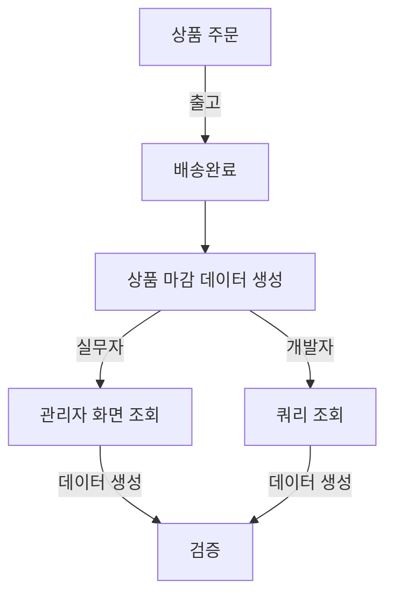

# career-architecture
> mermaid로 작성된 과제는 마크다운 파일(ARCHITECTURE.md)로 올려주시면 됩니다. (md 파일 내에 기존 구조를 넣어주세요) 
> 별도 아키택쳐나 모델링 도구를 사용한 경우에는 마크다운 파일(ARCHITECTURE.md)과 png, gif, jpg, pdf 파일 형식으로 architecture-{gitID}.png 파일명으로 upload 해주세요
# 요구사항
- [x] 담당 하는 업무에서 비효율적인 프로세스나 기술적 개선을 하고 싶은 부분의 현재 구조를 문서화 한다.
    - [x] 비효율적인 부분에 대한 분석내용을 정리한다.
    - [x] 비효율적인 부분에 대한 프로세스 또는 시스템 구조를 그려본다.

## 🚀미션
- 이름 : 김재한
### 개선포인트 분석
- 결제 데이터와 마감 데이터 간의 비교 검증이 필요.
  - 현재는 상품 주문에 대해서만 결제 데이터와 마감 데이터 간의 검증을 하고 있다.
- 현재는 상품 주문 기반으로 생성된 구 정산 데이터와 신 정산 데이터를 비교한다.
- 현재는 데이터를 보는 실무자와 개발자의 데이터 검증 방식이 약간 다름
  - 실무자 : 데이터를 화면에서 엑셀로 다운로드해서 시트로 비교해서 검증
  - 개발자 : 작성한 쿼리로서 데이터를 검증
- 결과적으로 같은 데이터를 보는거지만 방식의 차이도 통일해야할 필요가 있다.
- 데이터를 생성하고 비교용 자료를 만드는 데 주기적으로 시간이 소모된다.
- 검증을 통해 상품 주문의 버그를 찾아서 수정하는 경우가 많았으나 상대적으로 우선순위가 떨어져서 매번 반복적으로 해결하고 있다.
- 현재는 상품 주문에 대해서만 검증하지만 tobe에는 결제 전반에 대해서 마감과 검증하는 기능으로 확장을 해야 한다.

### 프로세스

