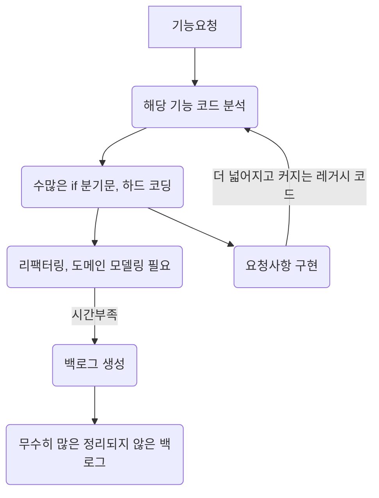
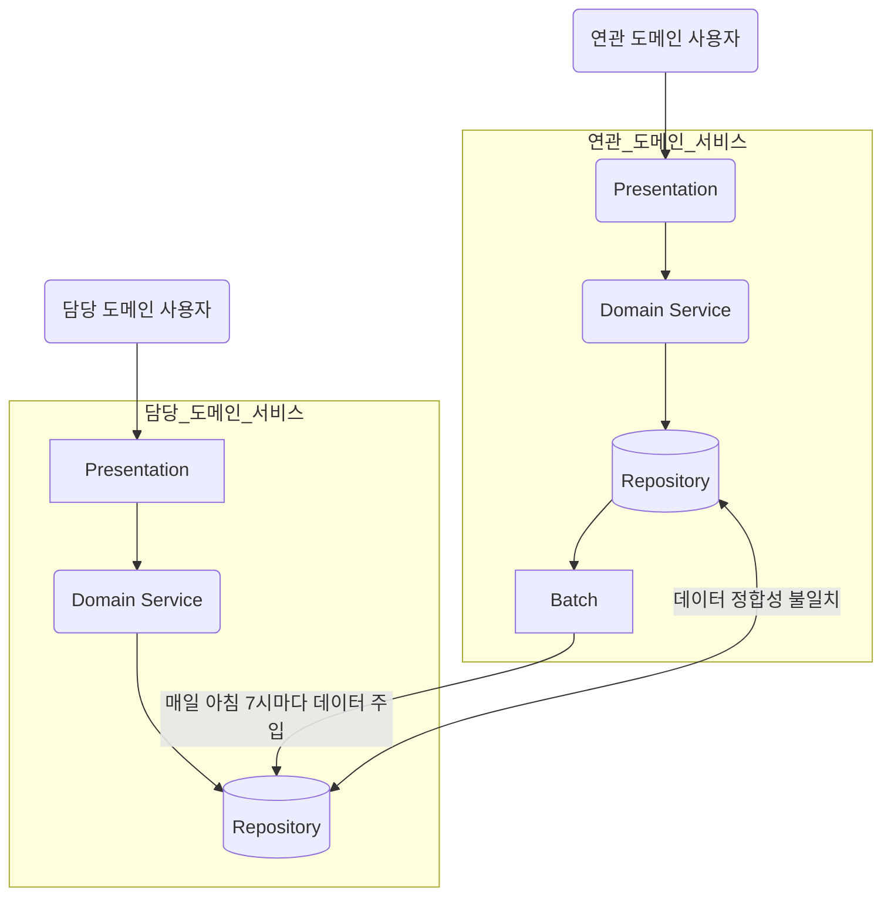
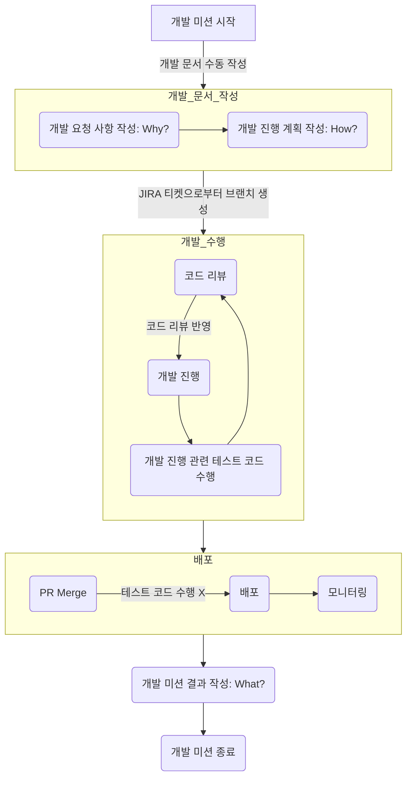

# 요구사항
- [x] 담당 하는 업무에서 비효율적인 프로세스나 기술적 개선을 하고 싶은 부분의 현재 구조를 문서화 한다.
  - [x] 비효율적인 부분에 대한 분석내용을 정리한다.
  - [x] 비효율적인 부분에 대한 프로세스 또는 시스템 구조를 그려본다.

# 🚀미션
- 이름 : 김신영

# 개선포인트 분석
- 절차지향적 프로그래밍으로 구현된 레거시 코드로 인해, 코드 분석에 많은 시간이 소요되고 유지보수성이 떨어진다.
- 외부 도메인 데이터를 따로 DB에 저장하고 있어서, 동기화 처리 요청이 매일 5~30건 수동으로 처리되고 있다.
- 개발 업무 진행시, 문서화가 부족하여 개발자들이 서로 다른 방식으로 개발을 진행하고 있다.
- 현재 테스트 코드가 모두 개발 DB(MySQL)에 의존하고 있어서, 테스트 코드를 실행하기 위해 개발 DB에 접근하는 것이 필수적이다.
  - 개발 DB에 접근하기 위해서는 개발 서버에 접속해야 하고, 개발 서버에 접속하기 위해서는 VPN 접속이 필요하다.
  - 개발 서버에 접속하기 위해서는 개발 서버에 접속할 수 있는 IP를 가진 PC가 필요하다.
  - Github Actions를 통해 CI/CD를 구축하고 있지만, 테스트 코드를 실행하기 위해 개발 서버에 접속하는 과정은 자동화되어 있지 않다.
  - 이에 따라, Github PR을 올렸을 때 자동으로 테스트를 실행하지 못하고 있다.
  - Test Container와 Flyway를 이용하여 테스트 코드를 실행하기 위한 개발 DB를 자동으로 생성하는 방안을 고려하고 있다.

# 프로세스
## 레거시 코드 유지보수성 관련 프로세스
- 도메인 모델링이 제대로 되어 있지 않아서, 기능을 추가하거나 수정할 때 마다 코드 분석에 많은 시간이 소요된다.
- 기능을 추가하거나 수정할 때 마다, 수많은 if 분기문과 하드 코딩으로 인해 코드가 점점 더 커지고 복잡해진다.
- 코드 리팩터링을 통해 도메인 모델링을 제대로 하고, 기능을 추가하거나 수정할 때 마다 코드 분석에 소요되는 시간을 최소화하고 싶다.

## 외부 도메인 데이터 동기화 관련 프로세스
- 외부 도메인 데이터에 대한 데이터 동기화를 수동으로 처리하지 않고 자동화할 수는 없을까?
- 안정성, 가용성, 데이터 정합성을 고려하여 어떤 방식으로 구현할 수 있을까?

## 개발 진행 시 문서화와 테스트 코드 관련 프로세스
- 개발 업무 수행시, 개발 문서 템플릿 작성 자동화할 순 없을까?
- 개발 진행 후, Github에서 PR올릴 때 자동으로 테스트 코드 실행할 순 없을까?
  - Infra 의존성을 최소화하고, 테스트 코드를 실행할 수는 없을까?

