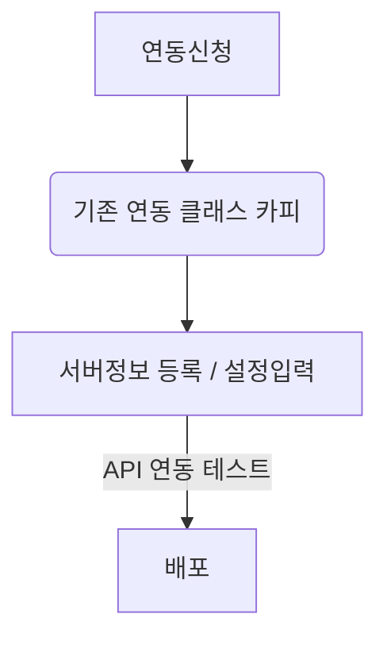
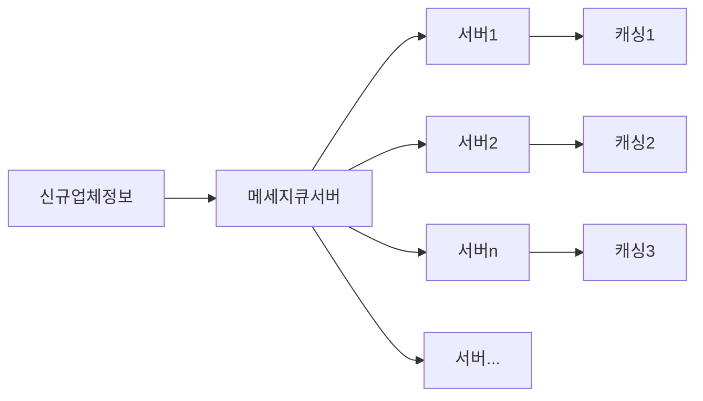

# career-architecture
> mermaid로 작성된 과제는 마크다운 파일(ARCHITECTURE.md)로 올려주시면 됩니다. (md 파일 내에 기존 구조를 넣어주세요) 
> 별도 아키택쳐나 모델링 도구를 사용한 경우에는 마크다운 파일(ARCHITECTURE.md)과 png, gif, jpg, pdf 파일 형식으로 architecture-{gitID}.png 파일명으로 upload 해주세요
# 요구사항
- [X] 담당 하는 업무에서 비효율적인 프로세스나 기술적 개선을 하고 싶은 부분의 현재 구조를 문서화 한다.
    - [X] 비효율적인 부분에 대한 분석내용을 정리한다.
    - [X] 비효율적인 부분에 대한 프로세스 또는 시스템 구조를 그려본다.

## 🚀미션
- 이름: 주명훈
### 개선포인트 분석
- 우리 회사는 외부업체와 API 연동을 통하여 사용자에게 서비스를 제공합니다.
- 외부업체 서버 정보 등록 및 API 연동을 위한 반복적인 작업이 필요합니다.
   - 동일한 코드를 복사 붙여넣어 업체별 클래스 생성
   - 업체별 서버정보 설정파일에 입력
- 중복 객체와 코드를 양산하게 되어 코드 품질 및 개발 리소스 낭비의 원인이 됩니다.

### 기술적용 아키텍쳐
### 프로세스

### 비고
- 올해 여름에 진행하였습니다.
- 메세지 큐를 활용하여 복수의 서버에 정보를 전달하고 각 서비스들은 해당 정보를 받아 캐싱합니다.
  - 업체별 서비스 객체 통합
  - 메세지 전파 및 캐싱 도입(rabbitmq & ehcache)
- 장점
  - 서버정보 변동에 대한 신속한 대응(신규 메세지 전파)
  - 신규 업체 연동 작업 리소스 절감

