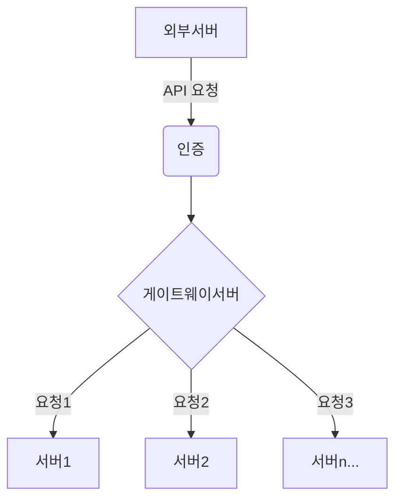

# career-architecture
> mermaid로 작성된 과제는 마크다운 파일(ARCHITECTURE.md)로 올려주시면 됩니다. (md 파일 내에 기존 구조를 넣어주세요) 
> 별도 아키택쳐나 모델링 도구를 사용한 경우에는 마크다운 파일(ARCHITECTURE.md)과 png, gif, jpg, pdf 파일 형식으로 architecture-{gitID}.png 파일명으로 upload 해주세요
# 요구사항
- [X] 담당 하는 업무에서 비효율적인 프로세스나 기술적 개선을 하고 싶은 부분의 현재 구조를 문서화 한다.
    - [X] 비효율적인 부분에 대한 분석내용을 정리한다.
    - [X] 비효율적인 부분에 대한 프로세스 또는 시스템 구조를 그려본다.

## 🚀미션
- 이름: 주명훈
### 개선포인트 분석
- Zuul to Spring Cloud Gateway
  - 자사 게이트웨이 서비스는 외부 서버에서 토큰인증을 통하여 들어온 요청을 해당하는 서비스에 보내주는
    통로 역할을 한다.
  - 스프링 프레임워크를 기반으로 Zuul 이라는 넷플릭스에서 개발한 라이브러리를 사용하여 역할을 수행한다.
  - 어느날 스프링측에서 해당 라이브러리를 더이상 관리하지 않게되었다.
  - 자사 서비스 스프링관련 유지보수 및 버전관리가 어려워 졌다. Zuul 대체 기술이 필요하다.

### 기술적용 아키텍쳐
### 프로세스

