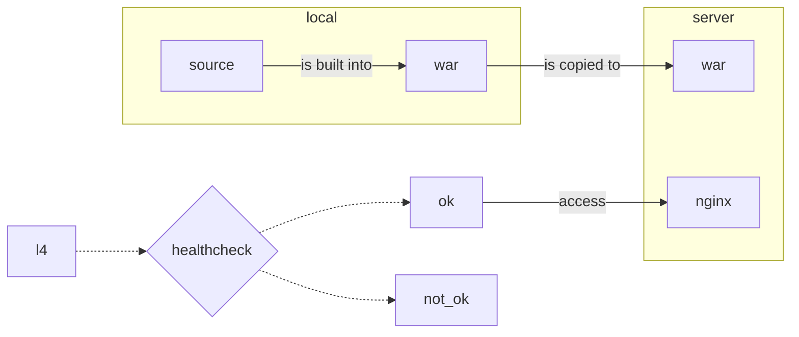
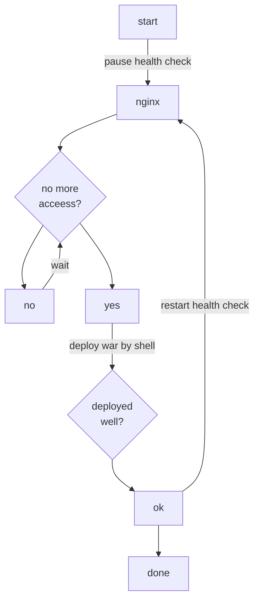

# career-architecture
# 요구사항
- [x] 담당 하는 업무에서 비효율적인 프로세스나 기술적 개선을 하고 싶은 부분의 현재 구조를 문서화 한다.
    - [x] 비효율적인 부분에 대한 분석내용을 정리한다.
    - [x] 비효율적인 부분에 대한 프로세스 또는 시스템 구조를 그려본다.

## 🚀미션
- 이름 : 배석진

### 기존의 배포 방식
- local에서 소스를 war로 빌드한다. ftp로 해당 파일을 서버로 복사한다.
- nginx의 healthchecker를 중지시켜 l4에서 더 이상 요청이 오지 않도록 한다.
- 더 이상 요청이 없음을 확인한다.
- war 파일을 한다.
- nginx의 healthchecker를 재실행한다.

### 개선포인트 분석
- 배포에 따른 각 스텝을 자동화한다.

---

### 배포와 관련한 시스템 구조

---

### 배포의 과정

