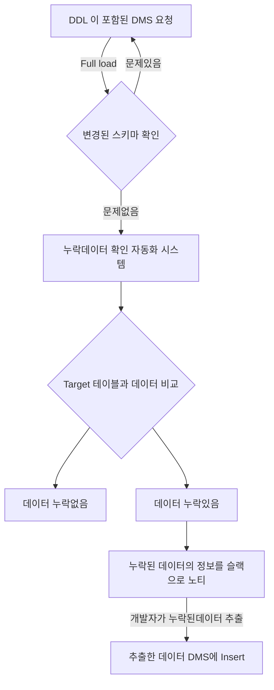

# career-architecture

> mermaid로 작성된 과제는 마크다운 파일(ARCHITECTURE.md)로 올려주시면 됩니다. (md 파일 내에 기존 구조를 넣어주세요)  
> 별도 아키택쳐나 모델링 도구를 사용한 경우에는 마크다운 파일(ARCHITECTURE.md)과 png, gif, jpg, pdf 파일 형식으로 architecture-{gitID}.png 파일명으로 upload 해주세요

# 요구사항

- [x] 자신의 하는 업무에서 개선하고 싶은 부분의 개선 구조를 문서화 한다.
    - [x] 비효율적인 부분에 대한 개선 기대효과를 정리한다.
    - [x] 비효율적인 부분에 대한 개선된 프로세스 또는 시스템 구조를 그려본다.

## 🚀미션

### 기대효과 분석

- 사람이 누락된 데이터를 확인하고 체워넣는 시간을 30분 정도로 줄일 수 있다.
- 휴먼 에러(같은 DB를 바라보는 것 등)를 없앨 수 있다
    - 반복 작업이다보니 같은 DB의 데이터를 비교해서 누락이 없다고 지나친 적도 있었지만, 이런 에러를 아예 없앨 수 있다.
- DMS Full load 시점이 점검날짜와 겹치는 경우, 신경쓰지않고 점검에 집중 할 수 있다.

### 프로세스

