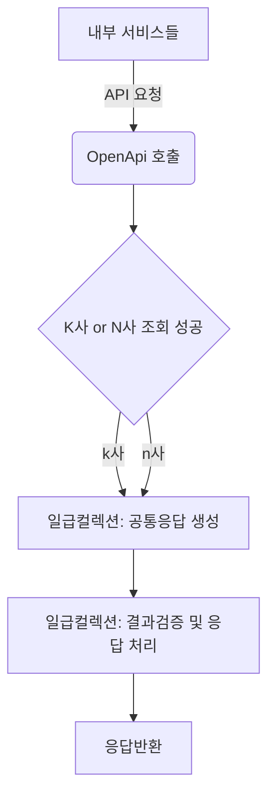

# career-architecture
> mermaid로 작성된 과제는 마크다운 파일(ARCHITECTURE.md)로 올려주시면 됩니다. (md 파일 내에 기존 구조를 넣어주세요)  
> 별도 아키택쳐나 모델링 도구를 사용한 경우에는 마크다운 파일(ARCHITECTURE.md)과 png, gif, jpg, pdf 파일 형식으로 architecture-{gitID}.png 파일명으로 upload 해주세요
# 요구사항
- [X] 자신의 하는 업무에서 개선하고 싶은 부분의 개선 구조를 문서화 한다.
  - [X] 비효율적인 부분에 대한 개선 기대효과를 정리한다.
  - [X] 비효율적인 부분에 대한 개선된 프로세스 또는 시스템 구조를 그려본다.

## 🚀미션
- 이름: 주명훈
### 기대효과 분석
 - 서버 비용 감소
   - (신)서버에 트래픽이 증가하나, (구)서버를 종료 할 수 있다.
 - 코드품질 향상
   - 가독성 증가
   - 추후 주소관련 유지보수에 도움이 될 수 있다.
### 기술적용 아키텍쳐
- 주소검색결과 리스트의 일급컬렉션 클래스를 생성한다.   
- 관련된 모든 검증 및 응답관련 로직이 해당 클래스에 모인다.

