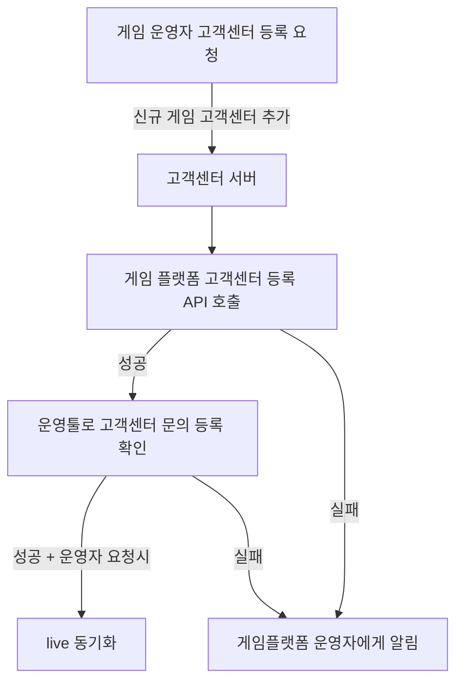

# career-architecture
> mermaid로 작성된 과제는 마크다운 파일(ARCHITECTURE.md)로 올려주시면 됩니다. (md 파일 내에 기존 구조를 넣어주세요)  
> 별도 아키택쳐나 모델링 도구를 사용한 경우에는 마크다운 파일(ARCHITECTURE.md)과 png, gif, jpg, pdf 파일 형식으로 architecture-{gitID}.png 파일명으로 upload 해주세요
# 요구사항
- [X] 자신의 하는 업무에서 개선하고 싶은 부분의 개선 구조를 문서화 한다.
    - [X] 비효율적인 부분에 대한 개선 기대효과를 정리한다.
    - [X] 비효율적인 부분에 대한 개선된 프로세스 또는 시스템 구조를 그려본다.

## 🚀미션
### 기대효과 분석
- 매달 비효율적으로 발생하던 약1-2시간의 업무를 자동화하여 줄일 수 있다.
- 게임플랫폼 운영자 등록하던 부분을 고객센터 생성 시 게임플랫폼 고객센터 등록 API 호출하도록 변경하여 운영자의 시간과 고객센터를 잘못 등록하는 실수를 줄인다.
- 라이브 동기화 시 별도로 개발환경에서 확인된 고객센터를 동기화 할 수 있도록 변경해서 불필요한 등록 과정을 없애고 실수를 줄인다.
- 또한 운영자가 직접 고객센터의 문의를 등록하여 확인했던 부분을 관리자 툴에서 생성 후 등록해서 확인하는 툴로 변경하여 운영자가 직접 등록해서 테스트하는 번거로움을 줄인다.
 
### 프로세스

