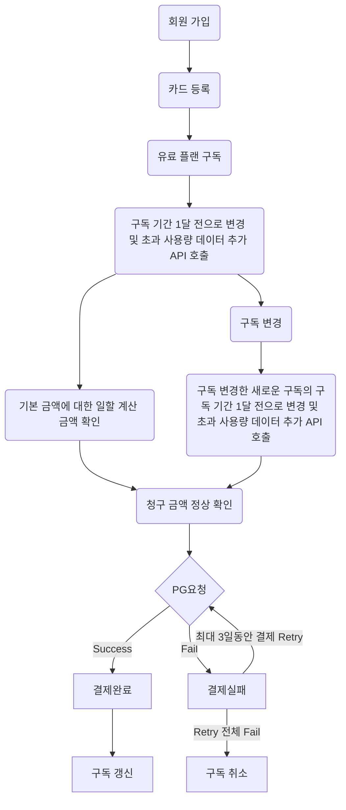
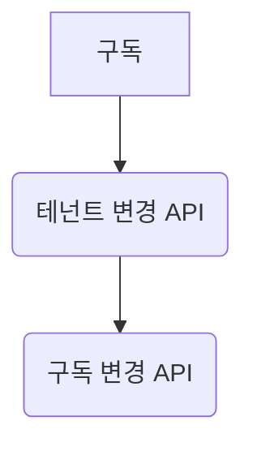
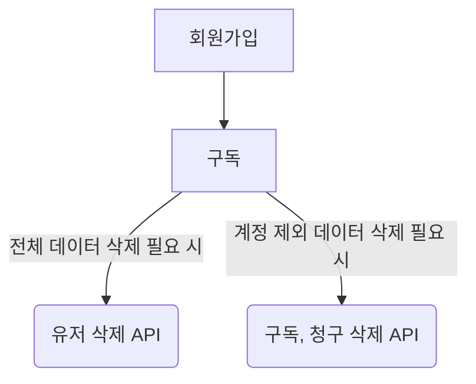

# career-architecture
> mermaid로 작성된 과제는 마크다운 파일(ARCHITECTURE.md)로 올려주시면 됩니다. (md 파일 내에 기존 구조를 넣어주세요)  
> 별도 아키택쳐나 모델링 도구를 사용한 경우에는 마크다운 파일(ARCHITECTURE.md)과 png, gif, jpg, pdf 파일 형식으로 architecture-{gitID}.png 파일명으로 upload 해주세요
# 요구사항
- [x] 자신의 하는 업무에서 개선하고 싶은 부분의 개선 구조를 문서화 한다.
  - [x] 비효율적인 부분에 대한 개선 기대효과를 정리한다.
  - [x] 비효율적인 부분에 대한 개선된 프로세스 또는 시스템 구조를 그려본다.

## 🚀미션
### 기대효과 분석
- 수동으로 하는 많은 Data 변경 작업을 API를 활용하여 시간 단축 할 수 있다.
- QA팀과 개발자 총 2명이 같이 일을해야 하는 작업을 QA 인원 1명이 혼자 작업할 수 있어 협업할 일정 조율이 필요하지 않고 공수가 줄어든다.
- 데이터 초기화를 위하여 담당자(나)에게 요청 하지 않고 초기화 하고 싶은 유저가 스스로 데이터를 삭제할 수 있다.
- 플랫폼과 제품 사이의 통신 및 동기화에 대한 이슈가 줄어든다.

### 프로세스
#### 프로세스 개선 포인트 1.의 개선 프로세스
* 필요한 API 
  * 구독 기간 1달 전으로 변경 및 초과 사용량 데이터 추가 API
  * 구독 시작일 특정 기간으로 변경하는 API
  * QA Full TC 확인 후 필요한 API 추가

#### 프로세스 개선 포인트 2.의 개선 프로세스
* 필요한 API
  * 구독 변경 API

#### 프로세스 개선 포인트 3.의 개선 프로세스
* 필요한 API
  * 유저 삭제 API
  * 구독, 청구 삭제 API

#### 아키텍처 개선 포인트 1.의 개선 프로세스
* 이 부분은 아키텍처 고민이 좀 더 필요 할 것 같아 고민 후 개선 프로세스 작성 예정

