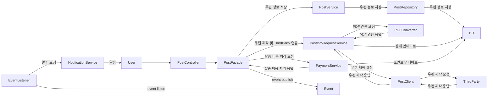
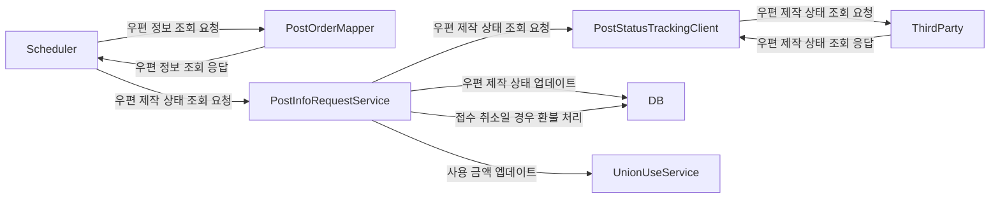
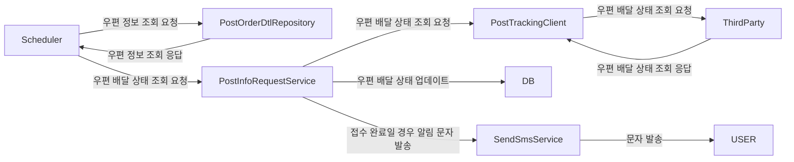

# career-architecture
> mermaid로 작성된 과제는 마크다운 파일(ARCHITECTURE.md)로 올려주시면 됩니다. (md 파일 내에 기존 구조를 넣어주세요)  
> 별도 아키택쳐나 모델링 도구를 사용한 경우에는 마크다운 파일(ARCHITECTURE.md)과 png, gif, jpg, pdf 파일 형식으로 architecture-{gitID}.png 파일명으로 upload 해주세요
# 요구사항
- [ ] 자신의 하는 업무에서 개선하고 싶은 부분의 개선 구조를 문서화 한다.
    - [ ] 비효율적인 부분에 대한 개선 기대효과를 정리한다.
    - [ ] 비효율적인 부분에 대한 개선된 프로세스 또는 시스템 구조를 그려본다.

# 예시 3

## 🚀미션
### 기대효과 분석
- DTO, VO, Entity를 사용 목적과 책임에 맞게 분리하여 SRP 원칙을 지키고
  코드에 대한 이해와 가독성을 향상시켜 다른 개발자가 코드를 파악하는데에 있어 비용을 절감시킬 수 있음

- PDF 변환 책임을 갖는 별도의 클래스를 생성하여 보다 객체지향적인 개발을 진행하고
  무분별한 Setter 사용을 줄이고 빌더나 명확한 메서드를 사용하여 값을 할당함으로써
  어떤 부분에서 어떤 의미로 사용되는지 코드에 대한 이해를 명확히할 수 있음

- 불필요한 RabbitMQ 사용을 줄여 코드의 관리 포인트를 줄일 수 있고
  심플해진 코드를 파악하거나 이해하는데에 있어 비용을 절감시킬 수 있음

- 우편 발송 코드를 리팩토링하며 기존에 PostService에서 우편 정보 저장, 우편 제작 및 ThirdParty연동,
  발송 비용 처리 등 많은 책임을 가지고 있어 SRP 원칙을 위배하고 있었으며 우편 접수 실패에 대한 정보를
  관리하기 위해 Facade 계층에서 이벤트를 발행하고 리스너가 이벤트를 받아 실패건에 대한 처리를 위한 프로세스 추가

#### post.png
#### 우편 발송, ThirdParty 연동, 비용 결제를 한 이후에(트랜잭션이 커밋된 이후) 이벤트를 발행하는게 맞는건지 
#### 아니면 Facade 계층부터 트랜잭션을 묶어 이벤트를 발행하는 부분까지 하나의 트랜잭션으로 관리하는게 맞는건지 궁금합니다.. 

### 기술적용 아키텍쳐
---
title: 우편 발송
---

---
title: 우편 제작 상태
---

---
title: 우편 배달 상태
---

