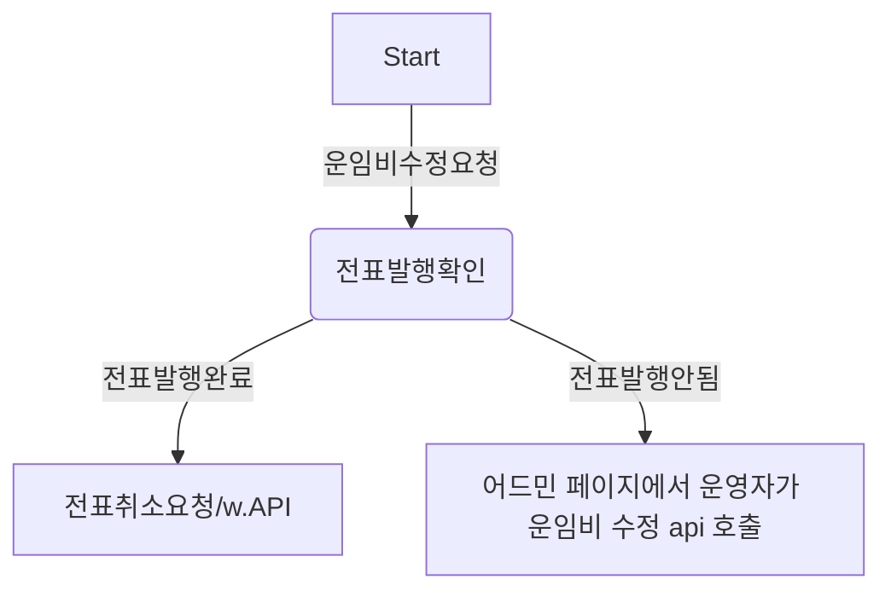

# career-architecture

> mermaid로 작성된 과제는 마크다운 파일(ARCHITECTURE.md)로 올려주시면 됩니다. (md 파일 내에 기존 구조를 넣어주세요)  
> 별도 아키택쳐나 모델링 도구를 사용한 경우에는 마크다운 파일(ARCHITECTURE.md)과 png, gif, jpg, pdf 파일 형식으로 architecture-{gitID}.png 파일명으로 upload 해주세요

# 요구사항

-   [x] 자신의 하는 업무에서 개선하고 싶은 부분의 개선 구조를 문서화 한다.
    -   [x] 비효율적인 부분에 대한 개선 기대효과를 정리한다.
    -   [x] 비효율적인 부분에 대한 개선된 프로세스 또는 시스템 구조를 그려본다.

## 🚀미션

### 기대효과 분석

-   개선 전
    -   수동으로 DB 데이터 수정하는데 1건당 최대 30분 소요. 하루에 평균 10건 처리. 하루 평균 해당 이슈 대응에 300분 소요
-   개선 후
    -   api를 만들어서 운영자에게 어드민 페이지를 통해 기능 제공 시 소요시간 없음
    -   하루 평균 300분을 더 개발에 사용할 수 있음

### 프로세스

