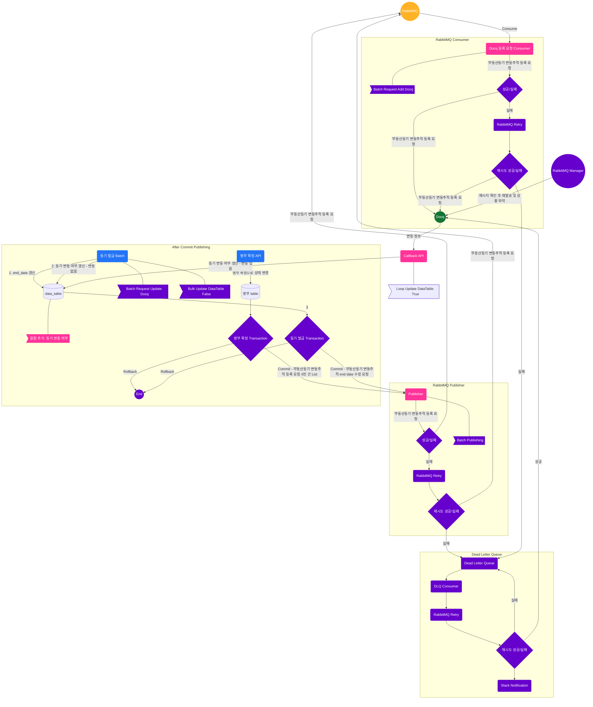

# career-architecture
> mermaid로 작성된 과제는 마크다운 파일(ARCHITECTURE.md)로 올려주시면 됩니다. (md 파일 내에 기존 구조를 넣어주세요) 
> 별도 아키택쳐나 모델링 도구를 사용한 경우에는 마크다운 파일(ARCHITECTURE.md)과 png, gif, jpg, pdf 파일 형식으로 architecture-{gitID}.png 파일명으로 upload 해주세요
# 요구사항
- [ ] 담당 하는 업무에서 비효율적인 프로세스나 기술적 개선을 하고 싶은 부분의 현재 구조를 문서화 한다.
  - [ ] 비효율적인 부분에 대한 분석내용을 정리한다.
  - [ ] 비효율적인 부분에 대한 프로세스 또는 시스템 구조를 그려본다.

## 🚀미션
- 이름 : 이병덕
### 개선포인트 분석
- AMQP로 **메시지 유실**을 없앤다.
  - Transactional Outbox Pattern + Polling Publisher Pattern을 써도 되지만 멱등성 관리 구현 및 DB Table도 만들어야 하기 때문에 채택하지 않는다.
- 메시지 실패 처리는 **재시도** 3회, 재시도 실패 시 DLQ로 보내고 DLQ에서 3회 재시도. 이것도 실패 시 슬랙 알림을 하여 원인 파악하여 수동 처리 
  - 수동 처리는 관리자 기능까지는 아직 만들지 않고, RabbitMQ Manager에서 직접 처리한다.
  - 이후 필요성을 느끼면 관리자 기능까지 만든다.
- 명부 확정 시 빠른 사용자 응답을 위해 MQ를 사용하여 **비동기** 처리한다.
  - WebClient를 써도 되겠지만 메시지 유실 관리가 되지 않는다.
- MQ의 Queue는 Docq의 변동 추적 CRUD는 모두 같은 Queue를 써서 Queue의 개수를 줄여 복잡도를 줄인다.
- MQ의 Exchage는 direct로 처리하여 간결하게 관리한다.
- 정확한 변동 상태를 제공해야 한다.
  - DB에 commit 된 후 이벤트가 발행되어야 한다. rollback이 되었는데 이벤트가 발행되면 정확한 보장이 되지 않는다. 
  - 변동 있음 상태이면 등기 발급을 사용자가 하기 때문에 돈이 차감되는데 이런 신뢰도가 저하되는 일을 방지해야 한다.
  - 정확한 데이터 보장을 위해 **After Commit Publishing** 방식을 채택한다.
- 명부 확정 시 DB 사용자에게 빠른 응답을 위해 네트워크 비용 개선을 위해 Bulk 처리해야 한다.
- Docq로 요청되는 등기 추적 요청은 모두 RabbitMQ의 같은 Queue로 보내서 시스템 및 코드의 일관성을 보장하여 유지보수 비용을 줄인다.
### 고민 및 질문
- Docq에 Loop로 요청이 아닌 bulk로 요청하도록 한다. docq에 문의 필요. 네트워크 비용이 많이 들기에 우리 서버에 부하 개선.
  - 이게 과연 3천 번 정도로 영향을 미칠까요?
- MQ로 publishing할 때 3천 건 정도는 loop로 처리해도 문제가 없다. 공식 문서상에도 나와 있다. 근데 이걸 꼭 1,000 건 단위로 Batch 처리를 해야 할까요?
- 등기 발급 배치 처리 시 실시간성이 아닌데 굳이 Bulk 처리로 DB에 update를 해야할까요? 그냥 loop 처리하면 안되나요?
- ~~RabbitMQ에 3천건 정도를 그냥 loop 처리해도 되나요?~~
  - RabbitMQ 자체가 [성능](https://www.rabbitmq.com/blog/2023/05/17/rabbitmq-3.12-performance-improvements#benchmark-tests)이 3천 건 정도는 전혀 무리가 없다고 공식 문서에 있다.
### 프로세스
