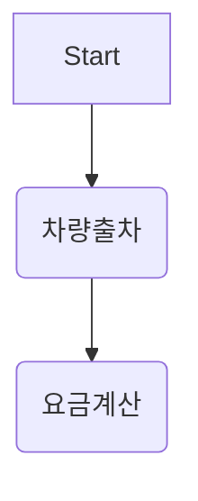

# 요구사항
- [ ] 담당 하는 업무에서 비효율적인 프로세스나 기술적 개선을 하고 싶은 부분의 현재 구조를 문서화 한다.
    - [ ] 비효율적인 부분에 대한 분석내용을 정리한다.
    - [ ] 비효율적인 부분에 대한 프로세스 또는 시스템 구조를 그려본다.


## 🚀미션
- 이름 : 배선교
### 기대효과 분석
 - if else 문의 중첩으로 코드 분석에 대한 가독성이 증가
 - 코드의 중복으로 인한 유지보수의 어려움 해소
 - Controller에서 비즈니스 로직을 분리하여 가독성 및 재사용성 증가
 - 디자인패턴을 적용하여 코드의 복잡도를 낮춤

### 프로세스


```mermaid
flowchart TB
    A[요금계산] --> B{차량 종류별 요금 계산 시간 생성}
    B --> C(정기차량)
    B --> D(예약차량)
    B --> E(영업용차량)
    B --> F(일반차량)
    B --> G(그외차량)
    C --> H(정기권 적용 시간 제외 날짜 생성)
    D --> I(예약차량 포인트 사용 확인)
    E --> J(영업용 무료 차량 확인)
    F --> K(요금 계산 옵션과 날짜에 따라 일별로 쪼개서 날짜 생성)
    G --> L(특수 차량에 따른 요금 계산)
    H --> M(요금 계산)
    I --> M
    J --> M
    K --> M
    L --> M
    ```
