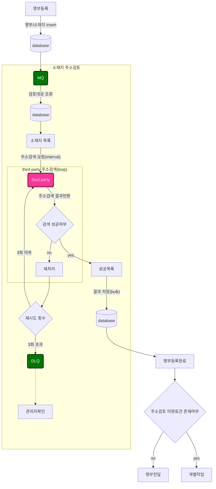

## 🚀미션
- 이름 : 박경민

```text
<개선방향>
1. (성능이슈) MQ send 및 consume 방식을 개선한다 => db connection 감소
    - MQ consume 시 loop 돌면서 DB connection 이 계속 발생하는 부분을 변경한다. 
    - MQ로는 우선 1개의 메시지만 send 한다
      => 메시지에는 어느 명부에서 요청했는지 id값 정도만 포함한다.
    - MQ에서 consume할 때 해당 id값으로 db에서 주소검토 대상을 조회 & 처리한다.
    - 처리결과의 경우 성공목록에 대해서만 결과를 insert/update bulk 저장한다.
       => 명부등록시 소재지 insert할 때 주소검토여부에 대한 초기데이터가 저장되므로,
          실패목록의 경우 추가적인 insert/update 과정이 필요없으므로 이 부분은 제거한다. 
2. (외부연동) 실패시 재처리 프로세스를 추가한다 => 자동화를 통한 수작업 축소
    - 코드레벨에서 최대 3회 재시도함으로써 일시적인 실패건수를 감소시킨다. 
    - 실제 바로 1번만 재시도만해도 성공하는 경우가 많으므로 성공율을 높일 수 있을 것 같다.
    - 해당 과정에서 4회 이상 실패시 DLQ에 쌓고 이부분은 관리자가 직접 확인하여 처리한다.(TBD)
3. (기타) third party 에 인터벌로 요청하도록 개선해본다 => third party 로의 한꺼번의 요청 부하를 줄인다.
    - third party 측에서 비동기 처리가 되어 있지 않는 것 같다. 한꺼번에 보내면 느려지거나 에러가 발생한다.
    - 단건으로 주소검색 요청시 sleep 처리를 추가한다.
    
```

### TO-BE 명부등록 프로세스(상세)

