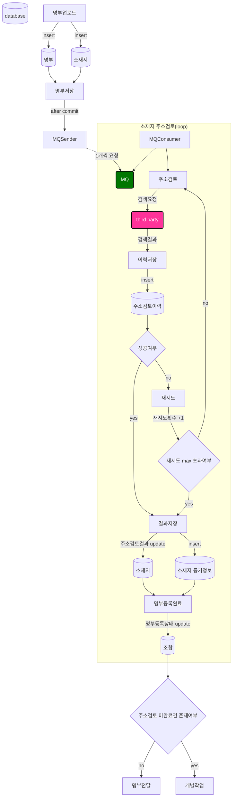

## 🚀미션
- 이름 : 박경민

```text
<개선방향>
1. (성능이슈) MQ send 및 consume 방식을 개선한다 => db connection 감소
    (1) MQ consumer에서 DB 주소정보 조회하는 부분을 제거한다.
      - message에 주소 seq가 아닌 주소정보 string을 넘겨서 MQ에서는 주소검토만 실행할 수 있도록 역할을 분리한다.
      - 대신 주소정보 insert 처리의 commit이 완료된 후 MQ send할 수 있도록 한다.(@TransactionalEventListener 사용)  
    (2) MQ consumer에서 주소검토결과를 bulk insert/update 로 변경한다.
2. (외부연동) 실패시 재처리 프로세스를 추가한다 => 자동화를 통한 수작업 축소
    (1) message 발행시 주소를 100개씩 실어 보낸다.
    (2) 최대 3회 재시도 프로세스를 추가하여 일시적인 실패건수를 감소시킨다. 
    - 우선 코드레벨에서 즉시 재시도해본다.(즉각적인 처리를 위해)  
    - 실제 바로 1번만 재시도만해도 성공하는 경우가 많으므로 성공율을 높일 수 있을 것으로 예상된다.
    (3) 재처리 프로세스에서 로그성 데이터 보관이 필요하므로, retry table(신규 생성)에서 관리한다.
    - 재처리 과정에서의 메시지 유실에 대비하여(서버다운 등 모종의 이유로 인한), retry table에 insert 한다.
    - 추후 필요하다면 retry table에서 재처리 3회가 이뤄지지 않은 건에 대해 batch 처리도 생각해본다.
    (4) third party 로의 한꺼번의 요청 부하를 줄인다.
    - MQ consumer에서 스레드를 1개로만 설정하여 message 소비를 직렬로 처리하게끔 한다.(현재는 2개) 
    
```

### TO-BE 명부등록 프로세스(상세)


