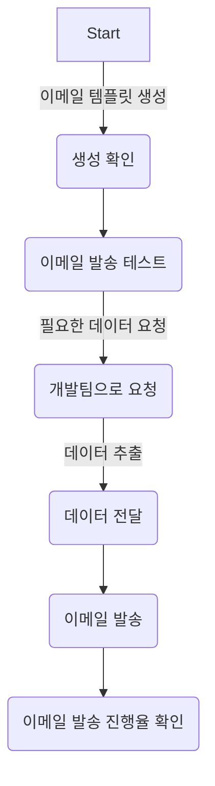

# career-architecture
> mermaid로 작성된 과제는 마크다운 파일(ARCHITECTURE.md)로 올려주시면 됩니다. (md 파일 내에 기존 구조를 넣어주세요)  
> 별도 아키택쳐나 모델링 도구를 사용한 경우에는 마크다운 파일(ARCHITECTURE.md)과 png, gif, jpg, pdf 파일 형식으로 architecture-{gitID}.png 파일명으로 upload 해주세요
# 요구사항
- [ ] 자신의 하는 업무에서 개선하고 싶은 부분의 개선 구조를 문서화 한다.
    - [ ] 비효율적인 부분에 대한 개선 기대효과를 정리한다.
    - [ ] 비효율적인 부분에 대한 개선된 프로세스 또는 시스템 구조를 그려본다.

## 🚀미션
### 기대효과 분석
- 필요한 데이터를 추출하는건 개발팀에서 할지라도 이메일 발송 처리는 요청 부서에 일임할 수 있다.
- admin에서 이메일 발송을 자동화하여 메일 발송 업무를 받지 않을 수 있다.
- 발송 테스트 기능을 추가하여 사람의 실수를 줄일 수 있다.
 
### 프로세스

