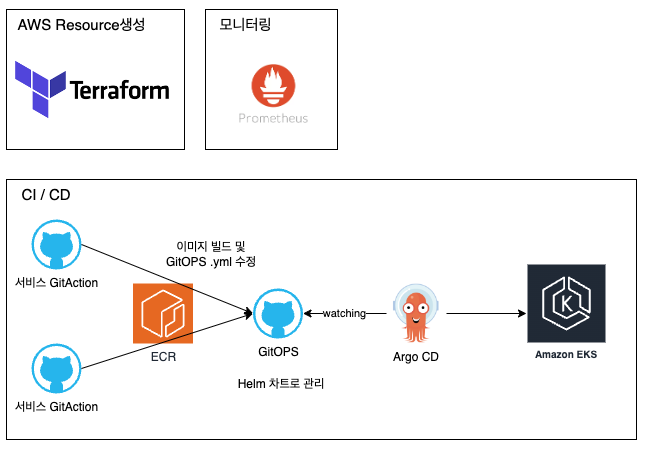

# career-architecture
> mermaid로 작성된 과제는 마크다운 파일(ARCHITECTURE.md)로 올려주시면 됩니다. (md 파일 내에 기존 구조를 넣어주세요)  
> 별도 아키택쳐나 모델링 도구를 사용한 경우에는 마크다운 파일(ARCHITECTURE.md)과 png, gif, jpg, pdf 파일 형식으로 architecture-{gitID}.png 파일명으로 upload 해주세요
# 요구사항
- [x] 자신의 하는 업무에서 개선하고 싶은 부분의 개선 구조를 문서화 한다.
    - [x] 비효율적인 부분에 대한 개선 기대효과를 정리한다.
    - [x] 비효율적인 부분에 대한 개선된 프로세스 또는 시스템 구조를 그려본다.

## 🚀미션
- 이름 : 최창훈

# 제안 1
### 기대효과 분석
- 에러 인지 확률 증가
  - 자동화된 알람을 통한 에러 인지 **증가** 
  - 운영채널로부터 보고받는 에러 인지 **감소**
- 시스템로그를 기반으로 빠른 문제파악 가능
  - stack-trace 내용도 저장하여 디버깅 시간 감소
  - 4**, 5**에러를 확실히 분리 
- 시스템 로그 저장
  - EKS에 올라간 서비스 로그는 CloudWatch에 저장
  - Vercel에 올라간 서비스 로그는 Kafka 큐로 보내서 저장

# 제안 2
### 기대효과 분석
- Terraform 사용
  - IaC의 기반을 마련하고, 멀티 클라우드 환경에 대비한다.
  - 파편화된 리소스 관리를 통일할 수 있다.
- Prometheus도입
  - 서비스 리소스 모니터링을 더 손쉽게 할 수 있다.
- Helm차트
  - Kustmoize 고도화

### 기술적용 아키텍처

# 제안 3
### 기대효과 분석
- Cucumber도입
  - 지금도 BDD기반 테스트를 작성중이고, 좀 더 자연스러운 Step사용이 가능하다.
- TestFixture 추출 스크립트
  - TestFixture데이터를 만들기 쉽게 하여 E2E테스트 작성이 빨라진다.

