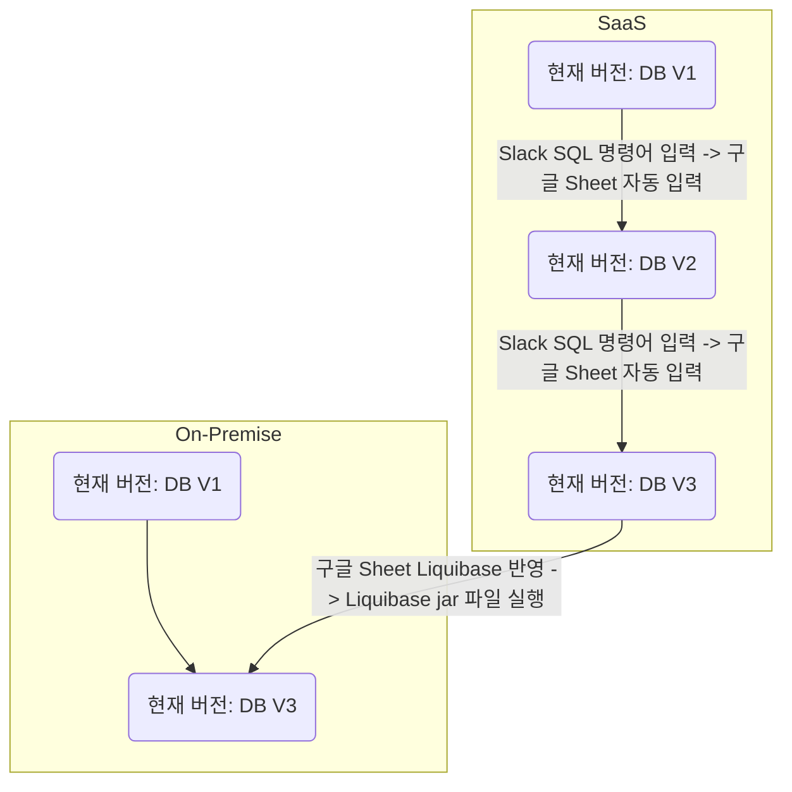

# career-architecture
> mermaid로 작성된 과제는 마크다운 파일(ARCHITECTURE.md)로 올려주시면 됩니다. (md 파일 내에 기존 구조를 넣어주세요)  
> 별도 아키택쳐나 모델링 도구를 사용한 경우에는 마크다운 파일(ARCHITECTURE.md)과 png, gif, jpg, pdf 파일 형식으로 architecture-{gitID}.png 파일명으로 upload 해주세요
# 요구사항
- [x] 자신의 하는 업무에서 개선하고 싶은 부분의 개선 구조를 문서화 한다.
    - [x] 비효율적인 부분에 대한 개선 기대효과를 정리한다.
    - [x] 비효율적인 부분에 대한 개선된 프로세스 또는 시스템 구조를 그려본다.

## 🚀미션(해야할 일)

### 기대효과 분석

DB 변경 요청 프로세스를 정립한다 
DB 변경 요청 시 구글 시트를 자동 기입함으로써
DB 스키마 변경 버전이 관리된다
DB migration 시 Liquibase를 사용하여 간단하고 편리하게 한다

### 프로세스 개선
