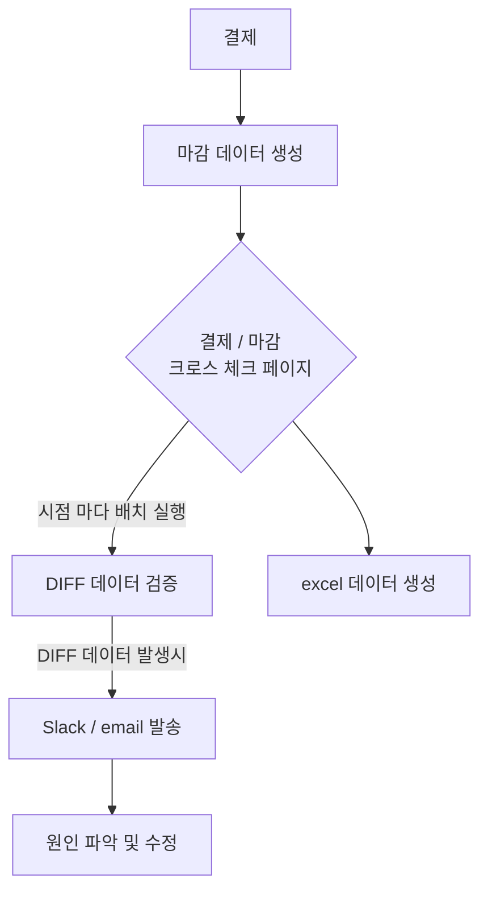

# career-architecture
> mermaid로 작성된 과제는 마크다운 파일(ARCHITECTURE.md)로 올려주시면 됩니다. (md 파일 내에 기존 구조를 넣어주세요)  
> 별도 아키택쳐나 모델링 도구를 사용한 경우에는 마크다운 파일(ARCHITECTURE.md)과 png, gif, jpg, pdf 파일 형식으로 architecture-{gitID}.png 파일명으로 upload 해주세요
# 요구사항
- [x] 자신의 하는 업무에서 개선하고 싶은 부분의 개선 구조를 문서화 한다.
    - [x] 비효율적인 부분에 대한 개선 기대효과를 정리한다.
    - [x] 비효율적인 부분에 대한 개선된 프로세스 또는 시스템 구조를 그려본다.

## 🚀미션
### 기대효과 분석
- 매일 배치로 데이터를 분석 하면 오류에 알림을 발송하면 사전 인식이 가능, 이로써 버그나 오류 요소에 대해 선재적 대응이 가능하다.
  - 매월 데이터를 검증을 하는 과정이 없어질 수 있음 (현재 월 검증 데이터 대략 21만 건 정도)
- 기존에 매월 검증 데이터를 만드는 과정을 admin의 화면 으로 대체 가능
- 싦무자와 개발자가 admin의 같은 페이지와 excel 데이터를 보면 검증 과정에 의사소통이 원활해진다.
- 상품 주문보다 상위의 개념인 결제 데이터를 기반으로 마감 데이터와 검증을 하면 추후 플렛폼에서 결제 옵션 확대시 유연한 대응 가능

### 프로세스

