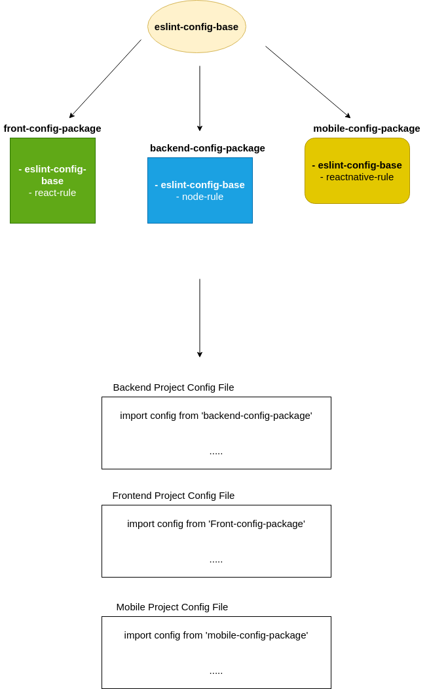

# career-architecture
> mermaid로 작성된 과제는 마크다운 파일(ARCHITECTURE.md)로 올려주시면 됩니다. (md 파일 내에 기존 구조를 넣어주세요) <br>
> 별도 아키택쳐나 모델링 도구를 사용한 경우에는 마크다운 파일(ARCHITECTURE.md)과 png, gif, jpg, pdf 파일 형식으로 architecture-{gitID}.png 파일명으로 upload 해주세요
# 요구사항
- [x] 자신의 하는 업무에서 개선하고 싶은 부분의 개선 구조를 문서화 한다.
    - [x] 비효율적인 부분에 대한 개선 기대효과를 정리한다.
    - [x] 비효율적인 부분에 대한 개선된 프로세스 또는 시스템 구조를 그려본다.

## 🚀미션
### 기대효과 분석
- 같은 내용을 복사, 붙여넣기 하는 과정을 줄임
- 확장성을 높임. 각 팀 또는 프로젝트 별로 필요한 [linter](https://ko.wikipedia.org/wiki/%EB%A6%B0%ED%8A%B8_(%EC%86%8C%ED%94%84%ED%8A%B8%EC%9B%A8%EC%96%B4))를 적용가능하게 함 

### 프로세스
```mermaid
flowchart TD
프로젝트 생성 -> linter 모듈 load
```

### 기술적용 아키텍쳐
- To-Be



