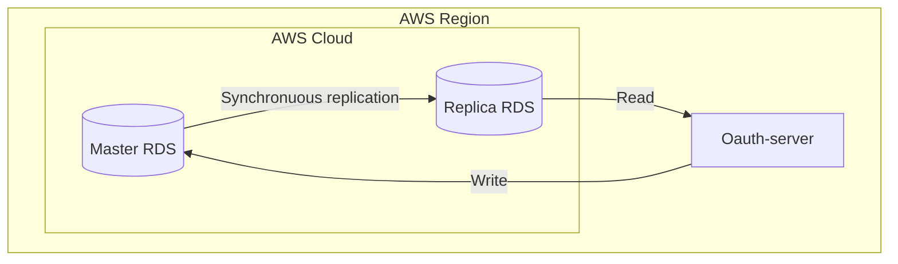
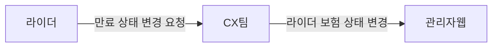
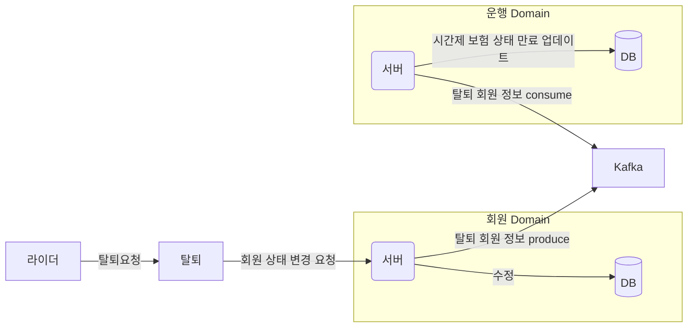

# career-architecture
## 🚀 미션

## #1 master db 만 사용 -> master / slave DB 사용

### 기대효과 분석
- 쿼리 요청을 분담함으로써 DB 부하를 분산할 수 있다. (현재 Read transaction 이 Write transaction 에 비해 3배 정도 많다.)
- Slave 중 하나를 Master로 활용하면 되기 때문에 데이터를 백업하는 용도로도 사용할 수 있다.
- 트래픽이 늘어남에 따른 병목현상을 완화 시킬 수 있다.

### 프로세스

## #2 시간제 보험 만료 상태 업데이트

### 기대효과 분석
- 관리자가 라이더의 보험 상태를 변경할 수 있는 API 를 제공한다.
- 라이더 회원 탈퇴시 이벤트 방식으로 운행서버에서 이벤트를 컨슈밍하여 탈퇴 회원의 존재하는 시간제보험 상태를 만료로 업데이트 한다. 
- 비효율적인 수동 데이터 수정에 걸리는 30분 정도의 시간을 제거할 수 있다.
- CX 팀과 개발팀간의 커뮤니케이션이 필요없어진다.
- 이벤트 방식으로 작동하므로 추후 타 도메인에 회원 탈퇴 후에 적용되어야 할 액션이 생긴다면 추가하기 쉽다.

### 프로세스
- 보험 해지 요청

- 탈퇴 요청
