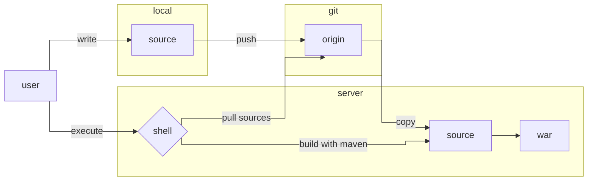
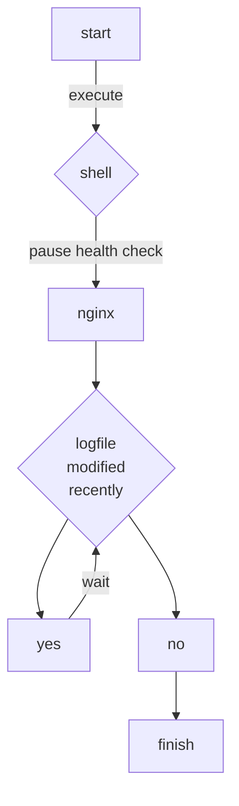

# career-architecture
# 요구사항
- [x] 자신의 하는 업무에서 개선하고 싶은 부분의 개선 구조를 문서화 한다.
    - [x] 비효율적인 부분에 대한 개선 기대효과를 정리한다.
    - [x] 비효율적인 부분에 대한 개선된 프로세스 또는 시스템 구조를 그려본다.

## 🚀미션
### 기대효과 분석
- 각 스텝에 필요로한 shell 파일을 생성한다. 직접 FTP를 다루거나 엔진엑스를 다루는 등 수정하는 과정을 제거하고 쉘의 실행으로 업무를 단순화. 
- 만약 각 각의 쉘이 정상적으로 동작하면, 차후 판단에 따라 쉘 전체를 통합하는 쉘을 생성 및 사용한다.

---

### 개선1. 프로젝트의 빌드 개선
- 빌드를 로컬이 아닌 서버에서 수행한다.
- 서버가 git을 통해 소스를 pull -> maven으로 소스를 war로 빌드

---

### 개선2. nginx의 헬스체크 개선
- nginx의 헬스체크 로직을 수행한다.
- nginx의 헬스체크를 중지 -> l4에서 더는 요청이 없을 때까지 대기
- "더는 요칭이 없"음에 대한 검증은 nginx의 로그파일의 최신 수정일자와 현재 시간 간 시간 차이로 결정. 예를 들면 5초 단위로 루프를 돌고, 로그 파일의 최종 수정 시간이 당시로부터 5초 전이면 요청이 더는 없다고 판단.

---

### 배포
- 각 상황이 완료되면 다음과 같은 형태로 배포한다.
- [개선1. 프로젝트의 빌드 개선] 으로 빌드한다.
- [개선2. nginx의 헬스체크 개선] 으로 더는 요청이 없음을 확인한다.
- war를 배포한다(기존 쉘 사용).
- nginx의 헬스체크를 재실행한다.

### 빌드와 관련한 다른 대안은?
- 메이븐의 빌드 과정을 서버에서 할 필요가 있는가?
- 서버에서 소스를 빌드 할 경우 
    - 서버에 깃, 메이븐을 설치하고 의존성(.m2)을 다운로드 한다.
    - 빌드 과정에서 컴퓨터 자원(cpu, memory 등) 사용한다.
- 현재 gitlab 설치형(on premise)을 사용 중. 내장된 CI/DI 기능을 사용할 수 있을지도?
- 플러그인을 사용하여 로컬에서 빌드한 파일을 서버로 바로 보내는 것이 가장 간단할지도?
    - Apache Maven Wagon : 리눅스 커맨드를 사용하는 등 다양한 기능이 내장된 것으로 보임

- > 현재 내용에 대해서는 좀 더 검토가 필요해 보이며, 혹시 변경 사항이 있으면 추가적으로 수정하겠습니다.