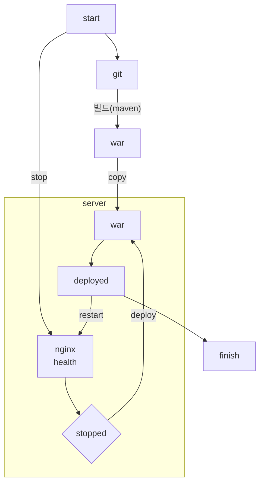

# career-architecture
# 요구사항
- [x] 자신의 하는 업무에서 개선하고 싶은 부분의 개선 구조를 문서화 한다.
    - [x] 비효율적인 부분에 대한 개선 기대효과를 정리한다.
    - [x] 비효율적인 부분에 대한 개선된 프로세스 또는 시스템 구조를 그려본다.

## 🚀미션
### 기대효과 분석
- Jenkins를 활용해 CI/CD를 구축하여 배포 시간을 축소한다.

---

### jenkins를 사용한 통합 배포
#### 헬스 체크
- 현 시스템은 서버 내부의 어플리케이션이 아닌 엔진엑스의 헬스체크만을 바라봄. 만약 엔진엑스 헬스체크가 잘 동작하고 어플리케이션만 멈출 경우, L4는 정상으로 판단하고 요청을 해당 서버와 어플리케이션에 계속 분배하며 클라이언트는 에러 메시지를 응답 받게 됨. 정상적인 로드밸런싱이 수행되지 않는 상태로서 이 부분은 차후 개선 필요.
- 결론적으로 배포 과정에서 L4가 요청을 정상적으로 분배하기 위해 유도하기 위해서는, 배포를 할 엔진엑스에 대한 헬스체크를 닫아야 한다.
- 헬스체크를 닫은 후, L4에서 요청이 오지 않을 때까지 대기한 후, 어플리케이션의 정지 및 배포 수행 필요.

#### jenkins 배포 서버
- 최근 회사는 ISMS와 금융 관련 심사로 인해 네트워크 및 보안 정책이 계속 바뀌는 상황. 
- 현재 테스트 서버의 경우 사내 네트워크로 접근 가능. 사내 네트워크에 접속되어 있는 컴퓨터에 jenkins를 설치하고 ssh를 조작하여 배포 진행.
- 현 내용은 테스트 서버를 기준으로 작성.

### 플로우
#### 전체적인 배포 플로우
- start부터 finish까지 젠킨스의 파이프라인으로 수행.
- 깃의 변경을 자동감지하지 않고 젠킨스 웹에서 배포를 결정 및 클릭. start는 클릭을 의미. 

